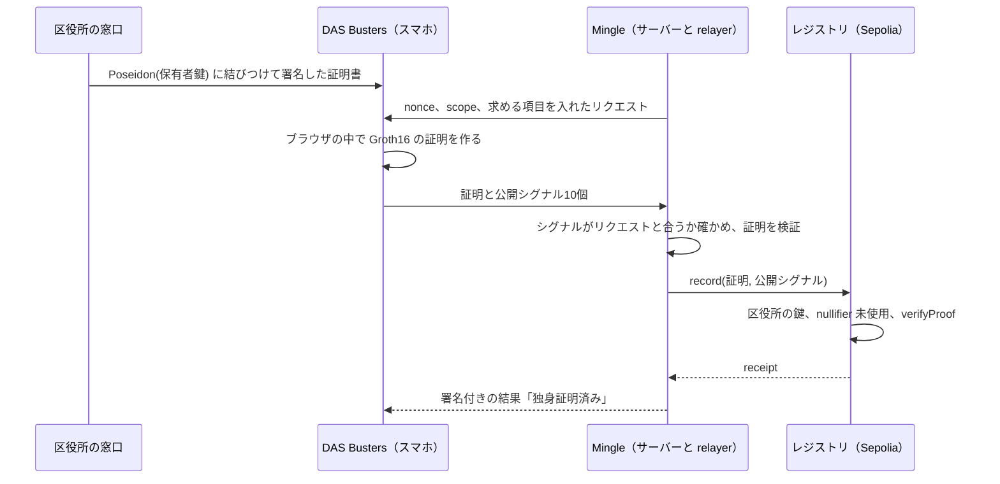

# DAS Busters

[English](README.md) | 日本語

DAS は Dating App Scam（マッチングアプリ詐欺）の略です。DAS Busters を使うと、マッチングアプリに「独身であること」だけを見せられます。氏名も生年月日も本籍も見せません。

ETHGlobal Tokyo 2026 で作りました。英語版の [README.md](README.md) が正本で、このページはその日本語訳です。[デモ](https://das-busters.vercel.app/?lang=ja) · [図で見るしくみ](https://das-busters.vercel.app/how-it-works?lang=ja) · [デモの手順](docs/demo.ja.md) · [技術的な詳細](docs/technical.ja.md)

## 問題

独身証明書は、本籍のある市区町村が数百円で発行している書類です。氏名、生年月日、本籍が載り、民法第732条（重婚の禁止）に抵触しないことを証明します（[江東区](https://www.city.koto.lg.jp/060303/dokusinsyoumei.html)）。結婚相談所や婚活向けのマッチングサービスは、いまもこれを求めています。ユーブライドは発行から3か月以内の証明書を、見切れや隠しのない写真で出すよう求めています（[ユーブライドのヘルプ](https://support.youbride.jp/hc/ja/articles/7335924102809)）。IBJ は3か月以内の原本です（[IBJ](https://www.ibjapan.com/marriage/p_6101/)）。独身だと伝えるだけのために、登録したばかりの会社へ氏名も生年月日も本籍も渡すことになります。

利用者も確認を望んでいます。タップルが2024年に5,429人に聞いた調査では、相手が独身だと何かしらの形で証明してほしいと答えたのが男性で83.8%、女性で97.4%でした（[デジタル庁](https://digital-agency-news.digital.go.jp/articles/2025-10-17)）。警察庁が2025年に把握した SNS 型ロマンス詐欺5,645件のうち、最初の接触がマッチングアプリだったのは1,846件（32.7%）で、経路の中でいちばん多い数字です（[警察庁](https://www.npa.go.jp/bureau/safetylife/sos47/new-topics/260605/01.html)）。

日本にはすでにデジタルの方法もあります。タップルの「かんたん独身証明」はマイナポータル経由で婚姻の状況を取りますが、アプリの手元には確認済みの本人情報が婚姻の状況と並んで残ります（[詳しく](docs/technical.ja.md#マイナンバーカードでの独身証明との違い)）。

## しくみ

DAS Busters は、マッチングアプリの利用者と、戸籍の情報を抱えずに独身かどうかを確かめたいアプリのためのものです。

1. 発行窓口で、区役所が Poseidon(保有者鍵) に結びつけた証明書に署名します。保有者鍵は、Google に紐づく Privy のウォレットが1回署名して作ります。証明書も鍵もスマホに残ります。
2. マッチングアプリ（サンプルの Mingle）が証明を求めます。共有する項目は本人が選びます。独身であること（必須）、東京在住（任意）、30代（任意。1987〜1996年生まれという意味）です。生まれ年そのものは隠れたままです。
3. スマホがブラウザの中で Groth16 の証明を作ります。nullifier は Mingle の同じ scope で証明するかぎり毎回同じで、ほかのアプリでは別の値になります。デモでは Mingle を開いたブラウザごとに scope が決まり、リセットすると変わります。
4. Mingle のサーバーが証明をリクエストと照らして確認し、relayer が nullifier を Ethereum Sepolia に記録します。レジストリはそこで証明をもう一度検証し、記録済みの nullifier を拒否します。そのアプリの scope の中では証明書1枚につき1アカウントになり、それを誰でも確かめられます。
5. 任意で、ウォレットは World ID の proof of human の確認を足せます。Mingle は、ある人が World ID のリクエストを承認したことも受け取ります。



API ルートとサーバーでの予備の証明まで入れた全体の流れは [docs/technical.ja.md](docs/technical.ja.md#全体の流れ) にあります。

## 本物と代役

証明、コントラクト、Google ログイン、World ID のリクエストは本物です。区役所と Mingle のバックエンドは代役で、私たちのサーバーで動かしています。

| 部分 | このデモでは |
|---|---|
| ゼロ知識証明 | 本物。circom の回路で、BN254 上の Groth16。証明はブラウザの中で作る。スマホで作りきれないときだけサーバーが作り、共有画面にもそう出る |
| ブロックチェーン | 本物。Ethereum Sepolia 上のコントラクトで、ソースは Sourcify で検証済み（exact match） |
| Google ログイン | 本物。Privy を通す。埋め込みウォレットは保有者鍵を作るためにメッセージへ1回署名するだけで、トランザクションは送らない |
| 人間確認 | リクエストは本物で、ID はテスト用。IDKit 4 のリクエストを World の Developer Portal が staging で検証し、World ID Simulator のテスト用 ID が承認する |
| 区役所 | 代役。私たちのサーバーが、Vercel の環境変数に置いたデモ用の EdDSA 鍵で署名する。デモのためだけの構成 |
| 証明書 | 中身は代役で、署名は本物。受け取りのたびに、渋谷区に住む架空の人物、佐藤 健さんの証明書を、あなた自身の保有者鍵に結びつけて発行する |
| Mingle | 代役のアプリ。バックエンドの検証と relayer は私たちのサーバーで動かしている |

ハブには、代役で動かせる部分ごとにバッジが4つ出ます。公開中のデモでは `ログイン: Google（Privy）`、`証明: Groth16`、`Sepolia に記録`、`人間確認: World ID staging` です。モック、オフチェーン、シミュレーションと出ていたら、その部分は代役です。World の Developer Portal が Simulator の証明を受け付けるのは、24時間の staging 窓のあいだだけです。いまの窓は2026年9月27日 23:53 JST に閉じ、そのあとの人間確認はシミュレーションと表示されます。実運用ならこの役割をどう分けるかは [デモの構成と実運用の構成](docs/technical.ja.md#デモの構成と実運用の構成) に書きました。

## 試し方

どの Google アカウントでも使えます。インストールは要りません。

1. [das-busters.vercel.app](https://das-busters.vercel.app/?lang=ja) を開き、**発行窓口** を押します。
2. QR コードの下で、PC なら **スマホがない場合は、このパソコンで続ける** を、スマホなら **このスマホで受け取る** を押します。2台で試すときは、PC の QR コードをスマホのカメラで読み取り、そのままスマホで続けます。
3. **Google で続ける** を押します。証明書は自動で保存されます。
4. **Mingle で独身証明を使う** を押し、Mingle で **DAS Busters で確認** を押します。
5. 共有する情報を選んで **選んだ情報を共有** を押します。画面には、ブラウザの中で証明を作るのにかかった時間と、Mingle が Sepolia に記録するまでの秒数が出ます。
6. Mingle のプロフィールで **Mingle が受け取った情報 ›** を押すと、Mingle が受け取ったもの、受け取っていないもの、Sepolia のトランザクションへのリンクが出ます。

- 人間確認は任意です。DAS Busters のホームの **World ID で確認** から始めます。World ID の staging 環境で World ID Simulator を使うので、World App は要りません。
- やり直すときは [/reset](https://das-busters.vercel.app/reset?lang=ja) を開きます。
- どの画面も英語と日本語に対応しています。EN / 日本語 の切り替えか `?lang=ja` で日本語になります。
- 手順を順に書いた台本と、うまくいかないときの対処は [docs/demo.ja.md](docs/demo.ja.md) にあります。

## 技術的な要点

- 回路（[circuits/single_proof.circom](circuits/single_proof.circom)）の制約は 9,921 個です。証明書の値と Poseidon(保有者鍵) に対する区役所の EdDSA-Poseidon 署名と、独身であることを確かめます。居住地と生まれ年の範囲は、共有するときだけ確かめます。
- nullifier は `Poseidon(holderSecret, scopeHash)` です。区役所が見るのは `Poseidon(holderSecret)` だけなので、スマホで証明したときは、区役所があなたの nullifier を計算して Mingle 上で探すことはできません（[lib/fields.ts](lib/fields.ts)）。
- 証明はスマホの snarkjs で作ります（wasm 2.7 MB と zkey 5.0 MB。共有画面を開いた時点で取りに行く）。`/api/prove` は予備で、使ったときは共有画面に出ます（[lib/deviceProver.ts](lib/deviceProver.ts)）。
- 回路は、隠した項目を 0 に、開示フラグを 0 か 1 に固定します。Mingle の検証も同じことをもう一度確かめます（[lib/verifier.ts](lib/verifier.ts)）。
- レジストリは発行者の鍵、nullifier、`verifyProof` の順に確かめ、nullifier だけを保存します。relayer は先にシミュレーションし、receipt を最大45秒待ちます。revert は失敗として画面に出します。オフチェーンの確認に切り替えるのは RPC か relayer の問題のときだけで、そのときも画面に表示します（[lib/chain.ts](lib/chain.ts)）。
- モードはすべてサーバーが env から決めます。Mingle はサーバーが動かしている方式の証明しか受け付けないので、クライアントがモックに格下げすることはできません（[lib/modes.ts](lib/modes.ts)、[lib/prover.ts](lib/prover.ts) の `verifyProof`）。
- World ID は IDKit 4 の `proofOfHuman` プリセットを使います。私たちのサーバーがリクエストに署名し、結果を staging の Developer Portal の `/api/v4/verify` に転送します（[World ID](docs/technical.ja.md#world-id)、[FEEDBACK.ja.md](FEEDBACK.ja.md)）。

## Sepolia のコントラクト

| コントラクト | アドレス | ソース |
|---|---|---|
| SingleProofRegistry | [0xDc813EC37A689e9927A9AA35203EdACC4822c217](https://sepolia.etherscan.io/address/0xDc813EC37A689e9927A9AA35203EdACC4822c217) | [Sourcify（exact match）](https://repo.sourcify.dev/11155111/0xDc813EC37A689e9927A9AA35203EdACC4822c217) · [Blockscout](https://eth-sepolia.blockscout.com/address/0xDc813EC37A689e9927A9AA35203EdACC4822c217) |
| Groth16Verifier（snarkjs が生成） | [0x0400a2Ab2F4F3b13Bfe08FF3e063107DfF31D4E8](https://sepolia.etherscan.io/address/0x0400a2Ab2F4F3b13Bfe08FF3e063107DfF31D4E8) | [Sourcify（exact match）](https://repo.sourcify.dev/11155111/0x0400a2Ab2F4F3b13Bfe08FF3e063107DfF31D4E8) · [Blockscout](https://eth-sepolia.blockscout.com/address/0x0400a2Ab2F4F3b13Bfe08FF3e063107DfF31D4E8) |

Blockscout では、レジストリの `record` の呼び出しと `SingleStatusVerified` のイベントがデコードされて表示されます。Etherscan では同じ内容が16進数のまま出ます。nullifier はイベントの最初の indexed topic です。自分で確かめるなら、次のコマンドが `true` を返します。

```sh
cast call 0xDc813EC37A689e9927A9AA35203EdACC4822c217 'used(uint256)(bool)' \
  0x290f3683289a58f9ec1166b55cf29189eebe531b7ad27d736a56bc2dbfea94e7 \
  --rpc-url https://ethereum-sepolia-rpc.publicnode.com
```

## テスト

| テスト | 件数 | 実行 |
|---|---|---|
| 回路（[scripts/circuit-test.ts](scripts/circuit-test.ts)） | 23件。うち13件で、改ざんした証明書、他人の保有者鍵、隠したはずの欄に値が入った入力を、回路そのものが拒否することを確かめる | `npm test` |
| 単体（[scripts/unit-test.ts](scripts/unit-test.ts)） | 24件 | `npm test` |
| Foundry（[contracts/test/SingleProofRegistry.t.sol](contracts/test/SingleProofRegistry.t.sol)）。生成した本物の検証器と本物の証明を使う | 13件 | `git submodule update --init && npm run test:contracts` |
| API を端から端まで通すスモークテスト（[scripts/smoke.ts](scripts/smoke.ts)） | スクリプト1本 | `BASE_URL=https://das-busters.vercel.app npm run smoke` |

攻撃ごとにどのテストが拒否を確かめているかは [docs/technical.ja.md](docs/technical.ja.md#テスト) にあります。

## 限界

- Trusted setup は各フェーズ1回ずつのローカルの contribution です。イベント中は Hermez の ptau のミラーが 403 を返したためです。
- 有効期限と失効は確認していません。発行日は署名の対象に入っていますが、確かめるには回路の鍵の作り直しと再デプロイが要ります。
- scope はアプリが決め、レジストリは scope を見ません。デモでは Mingle がブラウザごとに epoch を乱数で決めるので、別のブラウザで開いたりリセットしたりすると nullifier も新しくなります。
- World ID は証明書にも証明にも結びついておらず、World ID の nullifier の重複も確認していません。

どのルールを誰が受け持つかと、ほかのデモ用の近道は [セキュリティモデルと限界](docs/technical.ja.md#セキュリティモデルと限界) にあります。

## イベント前に作ったもの

ハッキング開始前にあったのは次のものです。

- アイデアとピッチ：アイデア、ピッチ資料、問題のリサーチ。
- 画面デザイン：全画面の Figma モックと、ピッチ動画の撮影に使ったクリックできるフロントエンドのモック。
- 技術検証：circom の証明を作り、ローカルチェーンで検証できるかを確かめたローカルのプロトタイプ。
- ブランド素材：DAS Busters のロゴ、Mingle のアイコン、サンプルのプロフィール写真。

事前に書いたコードはこのリポジトリに入っていません。モックは見た目の参考にしただけです。このリポジトリのコードはすべてイベント中に書きました。例外は上のブランド素材と、ethskills.com の公開スキルのファイル2つです（[AI_USAGE.ja.md](AI_USAGE.ja.md)）。

## AI の利用

開発のあいだ Claude Code を使いました。何を任せて何をチームでやったかは [AI_USAGE.ja.md](AI_USAGE.ja.md) に分野ごとにまとめています。

## ローカルで動かす

```sh
npm install
npm run dev
```

Node 22 以降が要ります。http://localhost:3000 を開いてください。`.env.local` がなければ連携はすべてモックで動き、ハブのバッジにもそう出ます。キー名は [.env.example](.env.example) にあります。ローカルで本物の証明を使う方法、コントラクトのテスト、同じ LAN のスマホから試すときの注意、回路の作り直しは [docs/technical.ja.md](docs/technical.ja.md#ローカルで動かす) にあります。デプロイと外部サービスは [docs/setup.ja.md](docs/setup.ja.md) です。

## ライセンス

GPL-3.0 です（[LICENSE](LICENSE)）。Groth16 の検証器と証明の生成には GPL-3.0 の snarkjs を使っています。MIT のレジストリのように、ファイルごとに SPDX の表記があるものはそのままにしています。書き換えると、Sourcify で検証済みのソースと一致しなくなるためです。
