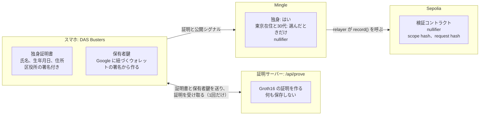
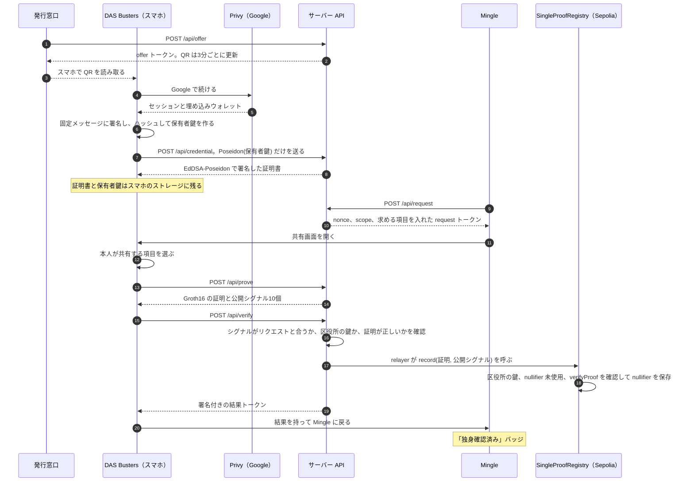
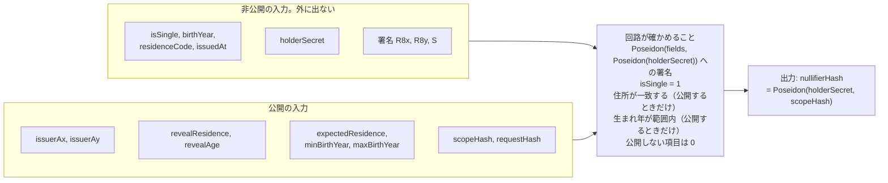
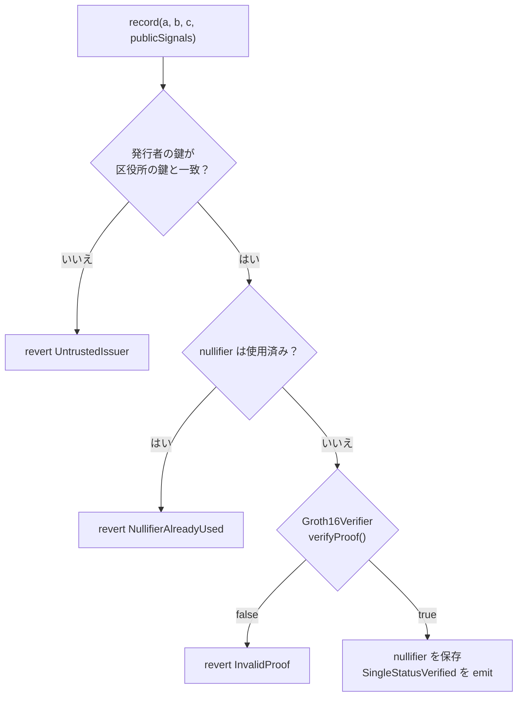

# DAS Busters

[English](README.md) | 日本語

マッチングアプリに「独身であること」だけを見せるアプリです。

ETHGlobal Tokyo 2026 で作りました。審査は英語で行われるので、正本は英語版の [README.md](README.md) です。このページはその日本語訳です。

**試す**: [das-busters.vercel.app](https://das-busters.vercel.app) · [デモの手順](docs/demo.ja.md)。押すボタンと話す内容を順に書いています。

**しくみ**: [das-busters.vercel.app/how-it-works](https://das-busters.vercel.app/how-it-works) で、署名、ゼロ知識証明、nullifier といった基礎から回路とコントラクトまでを、動く図で説明しています。各部分を確かめるリンクと、よく聞かれる質問への答えもあります。右上で日本語に切り替えられます。

## 解決したい問題

マッチングアプリでは、既婚なのに独身と偽る人がいます。区役所が出す独身証明書を見せれば白黒はつきます。ただ、そのコピーを送ると、会ったばかりの会社に氏名も生年月日も住所も渡すことになります。

## 作っているもの

- **発行窓口**: 区役所の窓口画面に QR コードが出ます。スマホで読み取ると、署名付きの独身証明書がスマホに入ります。
- **DAS Busters**: 証明書をスマホに保管するウォレットです。アプリから求められたら、何を証明するかを自分で選びます。
  - 独身であること（必須）
  - 東京在住であること（任意）
  - 30代であること（任意）
- **Mingle**: サンプルのマッチングアプリです。証明を検証して、プロフィールに「独身確認済み」のバッジを付けます。

証明にはゼロ知識証明（circom、Groth16）を使います。Ethereum に載るのは検証コントラクトと、検証1回につき nullifier 1つだけです。個人情報はチェーンに載りません。

## データの置き場所

証明書がスマホの外に出るのは、証明を作る1回のリクエストのときだけです。Mingle が受け取るのは「独身かどうか」の答えと nullifier です。Sepolia に保存されるのは nullifier とハッシュ2つです。トランザクションの入力には公開シグナルも入ります。中身は区役所の鍵と、共有を選んだときだけの東京の住所コードと生まれ年の範囲です。



## 全体の流れ

3つの画面は1つの Next.js アプリで動いています。API ルートが区役所と証明サーバーと Mingle のバックエンドを兼ねています。



## 言語

UI は英語が既定です。ハブ、窓口画面、ウォレットのホーム、Mingle の設定に EN / 日本語 の切り替えがあり、選んだ言語はその端末のすべてのアプリに効きます。URL に `?lang=ja` を付けても日本語になります。窓口画面の QR コードは、窓口の言語をスマホに引き継ぎます。

## 進み具合

ハッカソン期間中に作っています。実装計画は [docs/plan.md](docs/plan.md) にあります。

デモ: https://das-busters.vercel.app

| 項目 | 状態 |
|---|---|
| デモのハブとルーティング | 完了 |
| 全画面と、モックの証明での一連の流れ | 完了 |
| ゼロ知識証明（circom、Groth16、サーバーで証明） | 完了 |
| Sepolia でのオンチェーン検証 | 完了 |
| Privy 経由の Google ログインと、埋め込みウォレットからの保有者鍵 | 完了 |
| 英語と日本語の UI | 完了 |
| World ID（IDKit 4、World ID Simulator を使う staging） | 完了 |

## イベント前に作ったもの

ETHGlobal のルールでは、事前に作ったものとイベント中に作ったものを分けて申告します。ハッキング開始前にあったのは次のものです。

- **アイデアとピッチ**: アイデア、ピッチ資料、問題のリサーチ。
- **画面デザイン**: 全画面の Figma モックと、ピッチ動画の撮影に使ったクリックできるフロントエンドのモック。
- **技術検証**: circom の証明を作り、ローカルチェーンで検証できるかを確かめたローカルのプロトタイプ。
- **ブランド素材**: DAS Busters のロゴ、Mingle のアイコン、サンプルのプロフィール写真。

事前に書いたコードはこのリポジトリに入っていません。モックは見た目の参考にしただけです。このリポジトリのものは、すべてイベント中に書きました。

## 証明の仕組み

- **回路**: [circuits/single_proof.circom](circuits/single_proof.circom)。制約は 9,921 個です。
- **確認すること**
  - 証明書と保有者のコミットメントに対する、区役所の EdDSA-Poseidon 署名。
  - 独身であること。
  - 任意で、住所と生まれ年の範囲。
- **出力**: 保有者と検証者の scope ごとに決まる nullifier。
- **証明を作る場所**: 今はサーバーです（`/api/prove`、Vercel で1〜4秒ほど）。スマホはその1回のリクエストのために証明書を送り、サーバーは何も保存しません。プライバシーのための次の一歩は、証明をスマホの中で作ることです。
- **Trusted setup**: 公開されている ptau のミラーが使えなかったので、ローカルで1回だけ contribution しました。デモには足りますが、本番には使えません。



公開シグナルは `nullifierHash` が先頭で、そのあとに9個の公開入力が上の順で並びます。[lib/presentation.ts](lib/presentation.ts) もレジストリもこの順番を前提にしています。同じ保有者なら Mingle での nullifier も同じになるので、1枚の証明書で2つ目のアカウントを作るとレジストリが拒否します。`requestHash` は証明を1つのリクエストに縛るので、同じ証明を使い回せません。

## Sepolia のコントラクト

| コントラクト | アドレス |
|---|---|
| SingleProofRegistry | [0xDc813EC37A689e9927A9AA35203EdACC4822c217](https://sepolia.etherscan.io/address/0xDc813EC37A689e9927A9AA35203EdACC4822c217) |
| Groth16Verifier（snarkjs が生成） | [0x0400a2Ab2F4F3b13Bfe08FF3e063107DfF31D4E8](https://sepolia.etherscan.io/address/0x0400a2Ab2F4F3b13Bfe08FF3e063107DfF31D4E8) |

- **記録するもの**: Mingle が証明を確認したあと、relayer が `record` を呼びます。レジストリは区役所の鍵を確認し、証明を検証して、nullifier だけを保存します。イベントには nullifier と scope と request hash を出します。
- **証明書1枚につき1アカウント**: 同じ証明書で2つ目のアカウントを作ろうとすると拒否されます。
- **ソース**: [contracts/](contracts/)。テストは `cd contracts && forge test` で動きます。テストには本物の証明を使っています。



revert したら、Mingle は失敗として画面に出します。オフチェーンの確認に切り替えるのは Sepolia に届かないときだけで、そのときも画面にそう書きます。

## AI の利用

開発のあいだ Claude Code を使いました。何を任せて何をチームでやったかは [AI_USAGE.ja.md](AI_USAGE.ja.md) に分野ごとにまとめています。

## ローカルで動かす

```sh
npm install
npm run dev
```

http://localhost:3000 を開いてください。開発サーバーはすべてのネットワークインターフェースで待ち受けるので、同じ Wi-Fi のスマホから `http://<PCのIP>:3000` で開けます。
