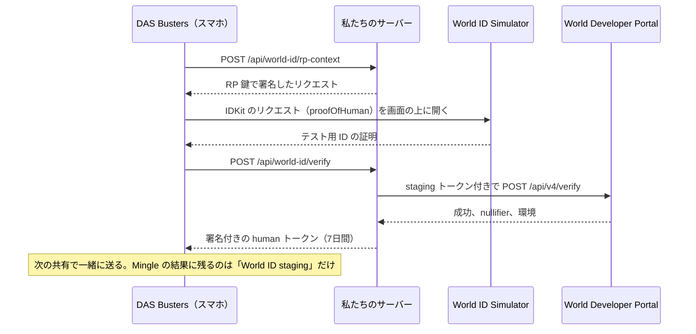
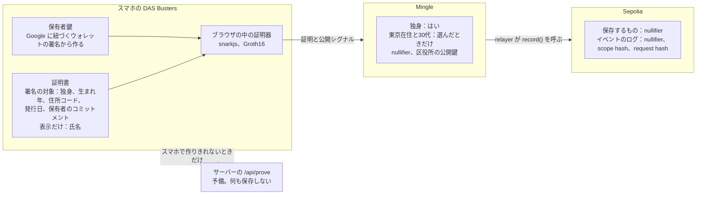
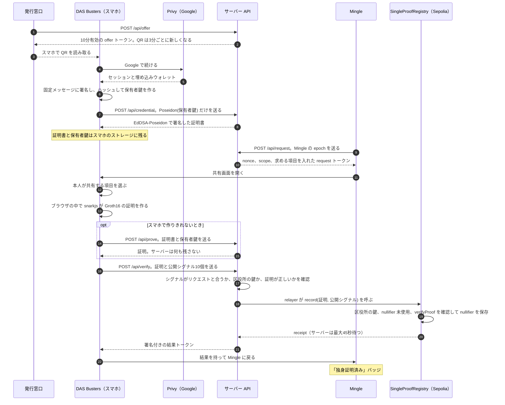
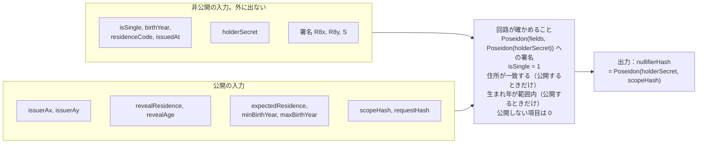
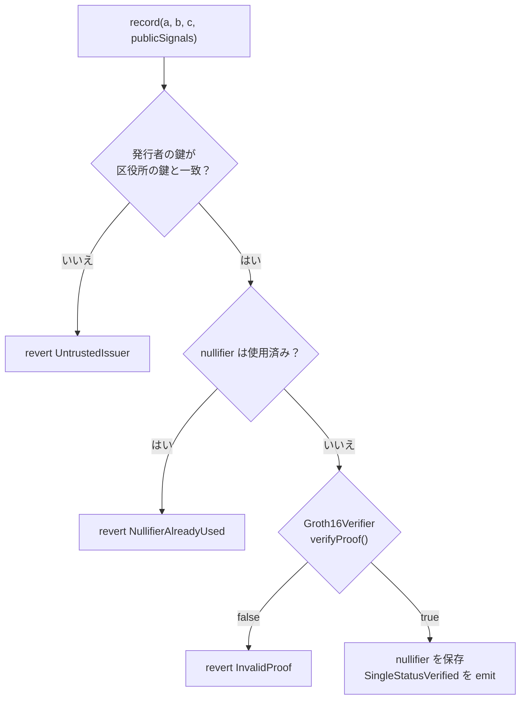

# DAS Busters

[English](README.md) | 日本語

**DAS は Dating App Scam（マッチングアプリ詐欺）の略です。** DAS Busters を使うと、マッチングアプリに「独身であること」だけを見せられます。氏名も生年月日も本籍も見せません。

ETHGlobal Tokyo 2026 で作りました。英語版の [README.md](README.md) が正本で、このページはその日本語訳です。**デモ**：[das-busters.vercel.app](https://das-busters.vercel.app)、**図で見るしくみ**：[/how-it-works](https://das-busters.vercel.app/how-it-works)（右上で日本語に切り替え）、**デモの手順**：[docs/demo.ja.md](docs/demo.ja.md)

## ひと目でわかる特徴

- **証明はスマホの中で作ります。** circom の回路（Groth16、制約 9,921 個）のゼロ知識証明をブラウザの中で作るので、証明書も鍵もスマホから出ません（[lib/deviceProver.ts](lib/deviceProver.ts)）。スマホで作りきれないときだけ、その1回分をサーバーが作り、画面にそう出します。
- **証明書1枚につき1アカウント。アプリをまたいだ追跡はできません。** アプリごとに別の匿名の番号（nullifier）が出ます。Ethereum Sepolia のコントラクトは同じ番号を2回は受け付けず、別のアプリには別の番号が見えます。コントラクトは2つとも [Sourcify でソース検証済み](#sepolia-のコントラクト)（exact match）です。
- **実在の書類が土台です。** 結婚相談所やマッチングサービスが、いまも紙面全体の写真で提出を求めている独身証明書をデジタルにしています。
- **大事なところをテストしています。** 回路のテスト23件のうち13件で、改ざんした証明書、他人の鍵、隠したはずの欄に値が入った入力を、回路そのものが拒否することを確かめています。ほかに単体テスト24件、本物の証明を使う Foundry のテスト13件、API を端から端まで通すスモークテストがあります。[テストしたこと](#テストしたこと) を見てください。
- **どこがデモかを隠しません。** ハブ、共有画面、Mingle のバッジに、本物と代役のどちらで動いているかが出ます。限界と実運用での構成も書いてあります：[セキュリティモデルと限界](#セキュリティモデルと限界)、[デモの構成と実運用の構成](#デモの構成と実運用の構成)。

## 何が問題か

独身証明書は、本籍のある市区町村が数百円で発行している書類です。氏名、生年月日、本籍が載り、民法第732条（重婚の禁止）に抵触しないことを証明します（[江東区](https://www.city.koto.lg.jp/060303/dokusinsyoumei.html)）。結婚相談所や婚活向けのマッチングサービスは、いまもこれを求めています。ユーブライドは発行から3か月以内の証明書を、見切れや隠しのない写真で出すよう求めています（[ユーブライドのヘルプ](https://support.youbride.jp/hc/ja/articles/7335924102809)）。IBJ は3か月以内の原本です（[IBJ](https://www.ibjapan.com/marriage/p_6101/)）。

利用者の側も証明を望んでいて、タップルが2024年に5,429人に聞いた調査では、相手が独身だと何かしらの形で証明してほしいと答えたのが男性で83.8%、女性で97.4%でした（[デジタル庁](https://digital-agency-news.digital.go.jp/articles/2025-10-17)）。警察庁が2025年に把握した SNS 型ロマンス詐欺5,645件のうち、最初の接触がマッチングアプリだったのは1,846件（32.7%）で、経路の中でいちばん多い数字です（[警察庁](https://www.npa.go.jp/bureau/safetylife/sos47/new-topics/260605/01.html)）。

困るのは写真のほうです。独身だと伝えるだけのために、登録したばかりの会社へ氏名も生年月日も本籍も渡すことになります。

## DAS Busters がすること

DAS Busters は、マッチングアプリの利用者と、戸籍の情報を抱えずに独身かどうかを確かめたいアプリのためのものです。区役所が署名したデジタルの証明書をスマホに置き、アプリ（サンプルの Mingle）には「独身である」というゼロ知識証明を渡します。「東京在住」と「30代」は、本人が選んだときだけ足します。ゼロ知識にしたのは、コピーや署名付きの証明書を渡すと、この1つの事実より多くが相手に伝わってしまうからです。アプリは nullifier も受け取ります。同じアプリに何度証明しても同じになる番号で、Ethereum Sepolia のコントラクトが公開の場で記録し、2回目は拒否します。そのアプリの scope の中では証明書1枚につき1アカウントになり、それを誰でも確かめられます。このデモでは区役所と Mingle を私たちのサーバーが演じ、受け取りのたびに架空の住民の証明書を発行します。証明、コントラクト、Google ログイン、World ID のリクエストは本物です。

## 3分で試す

どの Google アカウントでも使えます。インストールは要りません。

**1台で試す**（PC だけ、またはスマホだけ）

1. [das-busters.vercel.app](https://das-busters.vercel.app) を開き、**発行窓口** を押します。
2. QR コードの下で、PC なら **スマホがない場合は、このパソコンで続ける** を、スマホなら **このスマホで受け取る** を押します。
3. **Google で続ける**、**証明書を保存** の順に押します。
4. **Mingle で独身証明を使う** を押し、Mingle で **DAS Busters で確認**、**続ける** の順に押します。
5. 共有する情報を選んで **選んだ情報を共有** を押します。ブラウザの中で証明を作り、Mingle が検証して Sepolia に記録します。
6. Mingle のプロフィールで **Mingle が受け取った情報 ›** を押すと、Mingle が受け取ったもの、受け取っていないもの、Sepolia のトランザクションへのリンクが出ます。

**2台で試す**：PC で窓口を開き、スマホのカメラで QR コードを読み取ります。あとはスマホで手順3から続けます。

人間確認は任意で、DAS Busters のホームの **World ID で確認** から始めます。World ID の staging 環境で World ID Simulator を使うので、World App は要りません。やり直すときは [/reset](https://das-busters.vercel.app/reset) を開きます。[docs/demo.ja.md](docs/demo.ja.md) に、手順を順に書いたデモの台本と、うまくいかないときの対処があります。

ハブには、代役で動かせる部分ごとにバッジが4つ出ます。本番のデモでは `ログイン: Google（Privy）`、`証明: Groth16`、`Sepolia に記録`、`人間確認: World ID staging` です。モック、オフチェーン、シミュレーションと出ていたら、その部分は代役です。

## できること

- **発行窓口**（PC か iPad）：区役所の窓口画面に QR コードが出ます。読み取ると、区役所の署名が付いた独身証明書がスマホに入ります。
- **DAS Busters**（スマホ）：証明書を保管するウォレットです。アプリに求められたら、何を証明するかを自分で選びます。
  - 独身であること（必須）
  - 東京在住であること（任意）
  - 30代であること（任意）。1987〜1996年生まれという意味で、生まれ年そのものは隠れたままです。
- **Mingle**（スマホ）：サンプルのマッチングアプリです。会員はプロフィールに住んでいる街と年齢を自分で書いていて、Mingle はその裏付けをウォレットに求めます（[lib/mingle.ts](lib/mingle.ts)）。証明を検証してプロフィールに **✓ 独身証明済み** を出し、relayer が nullifier を Ethereum Sepolia に記録します。

### 本物と代役

| 部分 | このデモでは |
|---|---|
| 区役所 | 代役。私たちのサーバーが演じ、Vercel の環境変数に置いたデモ用の EdDSA 鍵で署名します。これはデモのためだけの構成です。[デモの構成と実運用の構成](#デモの構成と実運用の構成) を見てください。 |
| 証明書 | 中身は代役で、署名は本物。受け取りのたびに、渋谷区に住む架空の人物、佐藤 健さんの証明書を、あなた自身の保有者鍵に結びつけて発行します。 |
| Mingle | 代役のアプリ。バックエンドの検証と relayer は私たちのサーバーが演じます。 |
| ゼロ知識証明 | 本物。circom の回路で、BN254 上の Groth16 です。証明はブラウザの中で作ります。スマホで作りきれなかったときだけサーバーが作り、ボタンにもそう出ます。 |
| ブロックチェーン | 本物のコントラクトが公開テストネットの Ethereum Sepolia にあり、ソースは Sourcify で検証済みです。 |
| Google ログイン | 本物。Privy を通します。埋め込みウォレットは保有者鍵を作るためにメッセージへ1回署名するだけで、トランザクションは送りません。 |
| 人間確認 | 本物の World ID リクエスト（IDKit 4）を、World の Developer Portal が staging 環境で検証します。承認するのは World ID Simulator のテスト用 ID です。 |

## ゼロ知識にした理由

- 証明書のコピーを送ると、1つの事実を伝えるだけのために氏名、生年月日、本籍が渡ります。
- 区役所がアプリごとに「独身です」と署名する方式だと、どのアプリを使っているかが区役所に知られます。署名した文面から、アプリをまたいで同じ人だと結びつけられるおそれもあります。
- 選択的開示の付いた署名付き証明書（SD-JWT など）は他の項目を隠せます。それでも発行者の署名はどのアプリにも同じものが見えるので、そこから人を結びつけられます。「1987〜1996年生まれ」も、生年月日を見せずには示せません。

ゼロ知識証明なら事実だけを示し、署名と値は隠したままです。nullifier もアプリごとに別になります。

## ブロックチェーンを使う理由

まず Mingle のサーバーが証明を確認し、早く答えを返して、失敗なら理由を出します。そのあとレジストリのコントラクトが公開の場でもう一度確認し、記録済みの nullifier を拒否します。「アプリごとに証明書1枚で1アカウント」を誰でも確かめられ、Mingle があとから記録を消すこともできません。限界は、scope をアプリが決めることです。レジストリは証明がどの scope で作られたかを見ないので、scope を変えたアプリには新しい nullifier が届きます。デモのリセットがこれにあたります。

## マイナンバーカードでの独身証明との違い

マッチングアプリのタップルは2025年4月から「かんたん独身証明」を提供しています。マイナンバーカードの券面から氏名、住所、性別を読んでアカウントと照合し、マイナポータル経由で戸籍から婚姻関係の情報を取る仕組みです（[デジタル庁](https://digital-agency-news.digital.go.jp/articles/2025-10-17)、[タップルの発表](https://www.cyberagent.co.jp/news/detail/id=31851)）。この方式だと、使ったアプリごとに、確認済みの本人情報と婚姻状況が並んで残ります。

DAS Busters がアプリに渡すのは、確認済みの事実1つと、アプリごとに違う番号だけです。発行者は区役所の窓口でなくてもかまいません。デモの区役所の代わりにマイナポータルが証明書に署名しても、証明の側はそのまま使えます。

## World ID

独身証明書で証明できるのは婚姻の状況です。1人が Google アカウントをいくつも使っているかどうかまではわかりません。アカウントごとに保有者鍵が変わるので nullifier も変わりますし、このデモの窓口は QR を読み取った人なら誰にでも証明書を渡します。World ID は「実在の人がこれを承認した」を足すために入れています。

**proof of human で足りる理由**：IDKit の `proofOfHuman` プリセットを使っています（[app/wallet/world-id/IdkitRequest.tsx](app/wallet/world-id/IdkitRequest.tsx)）。婚姻の状況、居住地、年代は証明書が受け持つので、World ID に頼むのは「人であること」だけで済みます。proof of human はそれ以外、つまり名前も顔も ID 番号も渡しません。セルフィーチェックは、World 自身の説明では中程度の保証です。デバイスのカメラで、その場に本人がいるか（liveness）と顔の類似を確かめて sybil スコアを返し、その判断はアプリに任されます（[World のドキュメント](https://docs.world.org/world-id/idkit/credentials)）。1人1アカウントのためには、Orb に裏付けられた proof of human の一意性がほしかったのです。パスポートなどの書類系のクレデンシャルは、区役所の証明書と同じことを重ねて証明するうえに、利用者からもっと多くの情報を取ります。

**Mingle が受け取るもの**：World ID の確認が通ると、私たちのサーバーが署名したトークンをウォレットが送ります。Mingle のサーバーはこれを読むので、このアプリ用の World ID の匿名の番号（World ID の nullifier）も見えます。ただし Mingle が残す結果には、人間確認が通ったことと、その種類（World ID、World ID staging、シミュレーション）しか入りません（[app/api/verify/route.ts](app/api/verify/route.ts)）。このデモでは、トークンに署名するサーバーが Mingle のバックエンドも兼ねています。

**World ID を使わない場合**：人間確認は任意です。Simulator をキャンセルしても、確認自体を飛ばしても、共有は同じように動きます。Mingle には独身証明が出て、人間確認のバッジだけが付きません。この流れは [docs/demo.ja.md](docs/demo.ja.md#5b-world-id-を使わない場合任意) にあります。

**staging と本番**：このデプロイは World ID の staging で動いています。私たちのサーバーがリクエストに署名し（`/api/world-id/rp-context`）、結果を Developer Portal に転送します（`/api/world-id/verify`）。承認するのは World ID Simulator のテスト用 ID です。本番なら World App と実在の人になります。コードは `WORLDID_ENVIRONMENT` で切り替わりますが、本番の設定はしていません。どちらで動いたかは画面に出ます。

**staging の窓**：Portal が Simulator の証明を受け付けるのは、24時間の staging 窓が開いているあいだだけです。いまの窓は **2026年9月27日 16:58 JST** に閉じます。そのあとはサーバーが人間確認をシミュレーションと表示し、ハブは `人間確認: シミュレーション` になり、人間確認は5秒だけカメラを開く代役に変わります。

**いまの限界**：World ID の証明は、証明書にもゼロ知識証明にも結びついていません（リクエストに signal を入れていないため）。World ID の nullifier の重複も確認していません。いま言えるのは「ある人がこの World ID リクエストを承認した」までで、「1人が1アカウントを持っている」とは言えません。



組み込みの経過、詰まった点、あると助かるものは [FEEDBACK.ja.md](FEEDBACK.ja.md) に書きました。

## データの置き場所

証明書と保有者鍵はスマホに残り、証明もスマホが作ります。古いブラウザやメモリ不足で作りきれなかったときだけ、その1回のために証明書と保有者鍵を `/api/prove` に送ります。ボタンにもそう出て、サーバーは何も保存しません。Mingle が受け取るのは「独身」という答え、本人が共有を選んだ項目、nullifier、区役所の公開鍵です。公開鍵からは、どの区役所が署名したかがわかります。Sepolia に保存されるのは nullifier だけで、イベントのログには nullifier、scope hash、request hash が載ります。トランザクションの入力には証明と10個の公開シグナルが入ります。中身は区役所の公開鍵と、共有を選んだときだけの東京のコード（13）と生まれ年の範囲です。氏名、生年月日、住所はチェーンに載りません。



## 全体の流れ

3つの画面は、Vercel 上の1つの Next.js アプリで動いています。API ルートが区役所、予備の証明サーバー、Mingle のバックエンドを兼ねています。これはデモのための近道で、次の節で説明します。



## デモの構成と実運用の構成

このデモでは、Vercel 上の1台の Next.js サーバーが3者を兼ねています。発行者の EdDSA 署名鍵を環境変数（`ISSUER_PRIVATE_KEY`）に持つ区役所、予備の証明サーバー、そして Mingle のバックエンド（検証と relayer）です。3者のトークンはどれも同じ `TOKEN_SECRET` で署名しています。1つの URL で流れ全体を動かすための近道で、実際にこの3者が互いを信頼するときの形ではありません。実運用なら、区役所の署名鍵をアプリのサーバーに置くことはありません。

| 部分 | このデモ | 実運用での想定（設計のみで、作っていません） |
|---|---|---|
| 区役所（発行者） | デモ用サーバーの API ルート。署名鍵は Vercel の環境変数 | 市区町村が運用する。戸籍の全国システムやマイナポータルを通す形もありうる。署名鍵は役所自身のハードウェアセキュリティモジュール（HSM）から出さず、公開鍵を信頼できる発行者の一覧で公開する |
| ウォレット（DAS Busters） | Mingle と同じサイトの Web ページ。証明書と保有者鍵はブラウザの localStorage に置く | 独立したアプリか別の origin。鍵はスマホの安全な保存領域に置く |
| 証明器 | 既定はスマホ。スマホで作れないときだけデモ用サーバーが作る | スマホだけ |
| Mingle の検証 | 同じサーバーの API ルート。トークンの秘密鍵を他の役割と共有 | Mingle 自身のバックエンドと鍵。scope はアプリごとに固定し、nullifier が変わらないようにする |
| 記録 | Sepolia テストネット。手数料はデモ用サーバーの relayer が払う | 公開のメインネットか L2。トランザクションは Mingle（またはウォレット）が送る。コントラクトは、信頼できる発行者の一覧に照らして証明を確認する。そのとき集合への所属（たとえば区役所の鍵の Merkle root）として証明し、どの区役所かは明かさない |
| 人間確認 | World ID の staging と Simulator | 本番の World ID（World App）。この証明に結びつけ、nullifier の重複も確認する |
| 有効期限と失効 | 確認しない | Mingle が「この日以降の発行」を公開入力として求める。発行者は失効した証明書を公開する |

## 証明の仕組み

- **回路**：[circuits/single_proof.circom](circuits/single_proof.circom)。制約は 9,921 個です。
- **確認すること**
  - 証明書の値と保有者のコミットメント Poseidon(保有者鍵) に対する、区役所の EdDSA-Poseidon 署名。
  - 独身であること。
  - 任意で、住所と生まれ年の範囲。
- **出力**：保有者と検証者の scope ごとに決まる nullifier。
- **証明を作る場所**：ブラウザの中です。snarkjs と、サーバーと同じ回路のファイル（`single_proof.wasm` 2.7 MB、`single_proof.zkey` 5.0 MB）を使います（[lib/deviceProver.ts](lib/deviceProver.ts)）。共有画面を開いた時点でダウンロードを始めます。PC の Chrome では、ファイルがキャッシュに入ったあとの証明そのものは1秒かかりませんでした。スマホではまだ測っていません。スマホで作りきれなければ、その1回だけ `/api/prove` が作り、ボタンは「このスマホでは作れませんでした。DAS Busters のサーバーで証明を作成中…」になります。独身でない、他人の証明書、書き換えた証明書のようにルールを満たさない場合は、それが答えなのでサーバーでやり直しません。`PROVE_ON=server` にするとサーバーでの証明に戻ります。モックの証明は常にサーバーで作ります。
- **Trusted setup**：イベント中は Hermez の ptau のミラーが 403 を返したので、両フェーズともローカルで1回ずつ contribution しました（[circuits/build.sh](circuits/build.sh)）。デモには足りますが、本番には使えません。PSE の Perpetual Powers of Tau は取得できるので、次はそちらに移します。



公開シグナルは `nullifierHash` が先頭で、そのあとに9個の公開入力が上の順で並びます。[lib/presentation.ts](lib/presentation.ts) もレジストリもこの順番を前提にしています。同じ保有者なら、Mingle の同じ scope では nullifier も同じになります。レジストリはこれを使って、1枚の証明書での2つ目のアカウントを拒否します。`requestHash` は証明を Mingle のリクエスト1つに縛るので、別のリクエストには使い回せません。ただしサーバーはリクエストを使用済みにしないので、10分の有効期間内なら同じ証明がオフチェーンでもう一度通ります。Sepolia ではその nullifier は1回しか記録されません。

## Sepolia のコントラクト

| コントラクト | アドレス | ソース |
|---|---|---|
| SingleProofRegistry | [0xDc813EC37A689e9927A9AA35203EdACC4822c217](https://sepolia.etherscan.io/address/0xDc813EC37A689e9927A9AA35203EdACC4822c217) | [Sourcify（exact match）](https://repo.sourcify.dev/11155111/0xDc813EC37A689e9927A9AA35203EdACC4822c217) · [Blockscout](https://eth-sepolia.blockscout.com/address/0xDc813EC37A689e9927A9AA35203EdACC4822c217) |
| Groth16Verifier（snarkjs が生成） | [0x0400a2Ab2F4F3b13Bfe08FF3e063107DfF31D4E8](https://sepolia.etherscan.io/address/0x0400a2Ab2F4F3b13Bfe08FF3e063107DfF31D4E8) | [Sourcify（exact match）](https://repo.sourcify.dev/11155111/0x0400a2Ab2F4F3b13Bfe08FF3e063107DfF31D4E8) · [Blockscout](https://eth-sepolia.blockscout.com/address/0x0400a2Ab2F4F3b13Bfe08FF3e063107DfF31D4E8) |

- **ソースの検証**：どちらも Sourcify で [contracts/src/](contracts/src/) のソースと完全に一致しています。Blockscout では両方のソースが見られ、レジストリの `record` の呼び出しと `SingleStatusVerified` のイベントがデコードされて表示されます。Etherscan では同じ内容が16進数のまま表示されるので、読むときは Blockscout を使ってください。
- **記録するもの**：Mingle が証明を確認したあと、relayer が `record` を呼びます。レジストリは区役所の鍵と nullifier が未使用かを確認し、証明を検証して、nullifier だけを保存します。イベントには nullifier、scope hash、request hash を出します。
- **scope ごとに証明書1枚につき1アカウント**：同じ nullifier で2回目の記録をすると revert します。デモでは scope を決める epoch を Mingle のブラウザが持っているので、リセットすると新しくなります。本物の Mingle なら scope を固定します。
- **nullifier を自分で確かめる**：nullifier はイベントの最初の indexed topic で、16進数でも10進数でも渡せます。たとえば次のコマンドは `true` を返します。

```sh
cast call 0xDc813EC37A689e9927A9AA35203EdACC4822c217 'used(uint256)(bool)' \
  0x290f3683289a58f9ec1166b55cf29189eebe531b7ad27d736a56bc2dbfea94e7 \
  --rpc-url https://ethereum-sepolia-rpc.publicnode.com
```



revert したら、Mingle は失敗として画面に出します。オフチェーンの確認に切り替えるのは、Sepolia に届かない、relayer のテスト用 ETH が尽きたなど、revert 以外の理由で記録できなかったときだけで、そのときも画面にそう書きます。

## セキュリティモデルと限界

どの確認を誰が受け持っているか、まだ受け持っていないものは何かの一覧です。

| ルール | 受け持つところ |
|---|---|
| 区役所がこの値とこの保有者のコミットメントに署名した | 回路（EdDSA-Poseidon） |
| 署名した鍵が区役所の鍵である | Mingle の検証とレジストリ（`UntrustedIssuer`）。回路は鍵を公開入力として受け取るだけ |
| 証明書が独身を示している | 回路（`isSingle === 1`） |
| 証明している人が保有者鍵を持っている | 回路（コミットメントが署名の対象に入っている） |
| 共有した住所や生まれ年の範囲が、Mingle の求めたものと合う | 回路。値がリクエストと同じかは Mingle の検証が比べる |
| 隠した項目は 0 で、開示フラグは 0 か 1 | 回路と Mingle の検証 |
| 証明がこの Mingle のリクエストへの答えである | Mingle の検証（scope hash と request hash）。レジストリは証明を検証するだけで、scope は見ない |
| 公開シグナルがどれもスカラー体の法（field modulus）未満である | snarkjs の `verify` と、生成した Solidity の検証器 |
| nullifier は1回しか記録されない | レジストリ |
| リクエストに答えられるのは1回だけ | まだ。リクエストは状態を持たないので、10分の有効期間内なら同じ証明がオフチェーンで再び通る。オンチェーンでは nullifier は1回しか記録されない |
| 証明書が新しい | まだ。IBJ やユーブライドのような実際の確認先は、発行から3か月以内の証明書しか受け付けない。発行日はすでに署名の対象に入っているので、Mingle が「この日以降の発行」を公開入力として送る形にできる。そのためには回路の鍵を作り直してコントラクトをデプロイし直す必要があり、このデモには入れず次の段階とした |
| 失効 | まだ。発行者が失効した証明書を公開する形になる |
| アプリごとに scope を固定する | まだ。デモでは epoch を Mingle のブラウザが決めるので、リセットすると epoch も nullifier も新しくなる |
| World ID をこの証明に結びつけ、重複を確認する | まだ。World ID の証明は証明書にもこの証明にも結びついておらず、nullifier の重複も確認していない |
| 記録できるのは Mingle の relayer だけ | 制限していない。証明そのものが権限なので `record()` は誰でも呼べる。コピーされた未確定の呼び出しが先に入ると、私たちの relayer のトランザクションが revert し、Mingle はエラーを出す |

実運用なら持たない、デモのための近道です。

- 1つの `TOKEN_SECRET` で、offer、request、結果、人間確認のトークンを全部署名しています（[lib/token.ts](lib/token.ts)）。
- ウォレットと Mingle は同じ origin にあり、ブラウザの保存領域を共有しています。キーの接頭辞で分けているだけです（[lib/storage.ts](lib/storage.ts)）。
- 窓口は QR を読み取った人なら誰にでも健さんの証明書を渡します。本物の区役所なら、先に本人確認をします。
- 予備のサーバー証明を使ったときは、その1回のあいだサーバーに証明書と保有者鍵が見えます。モックの証明はいつもサーバーで作ります。
- Trusted setup は各フェーズ1回ずつのローカルの contribution です（[証明の仕組み](#証明の仕組み) を参照）。
- 発行者の鍵は公開シグナルに入っています。区役所が1つなら新しくわかることはありませんが、発行する役所が増えると、どこの役所が発行したかがわかってしまいます。信頼できる鍵の集合への所属として証明すれば隠せます。
- 回路は生まれ年を16ビットに収まるか確かめていますが、範囲の上下限は確かめていません。上下限が自分の求めた値と同じかは、Mingle の検証が確認しています。

## 設計の判断

- **証明はスマホで作り、サーバーは表示付きの予備にする。** 計画では、メンターの助言とイベント前のプロトタイプに合わせてサーバーで証明することにしていました（[docs/plan.md](docs/plan.md)）。9月26日にこれをブラウザの中へ移し、証明書と保有者鍵がスマホから出ないようにしました。その分 7.7 MB のダウンロードが要り、スマホでの速さはまだ測っていません。そのため `/api/prove` を予備に残し、使ったときはボタンに出します（[lib/deviceProver.ts](lib/deviceProver.ts)、[app/wallet/share/ShareScreen.tsx](app/wallet/share/ShareScreen.tsx)、[lib/modes.ts](lib/modes.ts) の `PROVE_ON`）。
- **nullifier は保有者鍵から作る。** `nullifier = Poseidon(holderSecret, scopeHash)` です。区役所が見るのは `Poseidon(holderSecret)` だけなので、区役所があなたの nullifier を計算して Mingle 上で探すことはできません。ただしこのデモでは予備の証明サーバーが同じサーバーで動くので、これが成り立つのはスマホで証明したときだけです。引き換えに、証明するたびに保有者鍵が手元に要ります（[lib/fields.ts](lib/fields.ts)、[circuits/single_proof.circom](circuits/single_proof.circom)）。
- **一意性は証明ではなく nullifier で判定する。** Groth16 の証明は、同じ内容のまま別のバイト列に作り変えられます。だからレジストリは証明のハッシュではなく `used[nullifierHash]` を記録します。一意性が保てるのは、scope が変わらない範囲だけです（[contracts/src/SingleProofRegistry.sol](contracts/src/SingleProofRegistry.sol)）。
- **隠した項目は 0 に固定する。** 回路は、フラグがオフの住所と年代の値を 0 にするよう強制し、Mingle の検証も値の入った隠し項目を拒否します。隠した項目に、共有したように読める値を紛れ込ませられません。ただしフラグ自体は公開なので、どの事実を共有したかはトランザクションから見えます（[lib/verifier.ts](lib/verifier.ts)）。
- **モードはサーバーが決める。** 連携ごとにモックと本物があり、env で選びます。Mingle の検証はサーバーが動かしている方式の証明しか受け付けないので、クライアントが本番をモックに格下げすることはできません。イベント前のプロトタイプでは、クライアントが `bypass:true` を送れば通りました。env が抜けると黙ってモックになるので、ハブ、共有画面、Mingle にモードのバッジを出しています（[lib/modes.ts](lib/modes.ts)、[lib/prover.ts](lib/prover.ts) の `verifyProof`）。
- **revert は失敗として扱う。** relayer は先に `record()` をシミュレーションし、revert（nullifier 使用済み、信頼していない発行者、無効な証明）はエラーとして利用者に出します。オフチェーンの確認に切り替えるのは RPC か relayer の問題のときだけで、画面にもそう出します。プロトタイプは revert を「オフチェーンで成功」に丸めていました（[lib/chain.ts](lib/chain.ts)）。
- **receipt を待つ。** 計画ではトランザクションのハッシュをすぐ返すつもりでした。コードは receipt を最大45秒待ち、あとで revert するトランザクションを「記録済み」と言わないようにしています。共有はその分、Sepolia のブロック1つぶん遅くなります（[lib/chain.ts](lib/chain.ts)）。
- **ガス代は relayer が払う。** 利用者は ETH が要らず、自分でトランザクションを送ることもありません。難点は、資金を入れたデモ用の鍵1つが全員の分を払うことです（[docs/setup.ja.md](docs/setup.ja.md#relayer-のガス代)）。
- **保有者鍵は Privy の埋め込みウォレットの署名から作る。** 固定のメッセージに1回署名すると Google アカウントに結びついた秘密ができ、シードフレーズを書き留める必要がありません。署名の SHA-256 を31バイトに切って、BN254 のスカラー体に収めています。プロトタイプでは256ビットの秘密がはみ出していました。署名が決定的でない場合に備えて、保存した値を正とします。そのかわり、鍵は Privy と Google アカウントに依存します（[lib/privy.ts](lib/privy.ts)、[app/wallet/_components/holderKey.ts](app/wallet/_components/holderKey.ts)）。
- **状態を持たない署名付きトークン。** offer、request、結果、人間確認は、有効期間の短い HS256 のトークンで受け渡します。Vercel 上でデータベースを持たずに済みます。ただ、リクエストを使用済みにはできません（[lib/token.ts](lib/token.ts)）。
- **イベント前の技術検証から得た教訓**（[docs/plan.md](docs/plan.md) の「プロトタイプの穴を繰り返さない」）。プロトタイプには次の穴がありました。
  - クライアントが人間確認を飛ばせた。
  - revert を成功に丸めていた。
  - 発行者の seed をコミットしていた。いまはリポジトリに公開鍵だけを置いています（[lib/zk/issuer-public.json](lib/zk/issuer-public.json)）。
  - 結果がリクエストに結びついていなかった。いまは nonce で結びつけます。
  - 保有者鍵がスカラー体からはみ出していた。
  - サーバーで証明しているのに、UI は端末から出ないと書いていた。

## テストしたこと

```sh
npm test                                              # ユニットテストと回路のテスト
npm run test:circuit                                  # 回路だけ。witness の段階での拒否と、1回の証明と検証
git submodule update --init && npm run test:contracts # Foundry。本物の証明で動かす
BASE_URL=https://das-busters.vercel.app npm run smoke # API を端から端まで。拒否のケースも含む
```

`CHAIN_MODE=sepolia` のデプロイに smoke を流すと、Sepolia にトランザクションが1つ送られます。そのあと試す2回目はシミュレーションの段階で拒否されるので、送られません。

| 攻撃 | 拒否するところ | テスト |
|---|---|---|
| 区役所が「独身でない」として署名した証明書 | 回路（`isSingle === 1`） | [scripts/circuit-test.ts](scripts/circuit-test.ts) |
| 生まれ年や住所を書き換える | 回路（署名の確認） | circuit-test.ts、smoke の「an edited certificate cannot prove」（[scripts/smoke.ts](scripts/smoke.ts)。サーバーの証明器が署名を先に確認して拒否） |
| 他人の証明書を使う（保有者鍵が違う） | 回路（保有者のコミットメントへの署名） | circuit-test.ts、smoke の「someone else's secret cannot prove」（証明器の事前確認で拒否） |
| 証明書に署名していない発行者の鍵 | 回路 | circuit-test.ts |
| 公開した範囲の外の生まれ年、公開した住所の食い違い | 回路 | circuit-test.ts |
| 隠した項目に値を入れる、開示フラグを 2 にする | 回路と Mingle の検証 | circuit-test.ts、[scripts/unit-test.ts](scripts/unit-test.ts) |
| 証明のあとで公開シグナルを変える | Groth16 の検証（オフチェーンとオンチェーン） | circuit-test.ts、`test_RevertWhen_DisclosedValueIsChanged`、smoke の「tampered signals are rejected」（Mingle のリクエスト照合で拒否） |
| 本物の証明をモックの証明と偽る | Mingle の検証 | circuit-test.ts |
| 証明の点を変える、または符号を反転する | Solidity の検証器（`InvalidProof`） | `test_RevertWhen_ProofPointIsChanged`、`test_RevertWhen_ProofPointIsNegated` |
| 公開シグナルに法を足してスカラー体の外に出す（同じ証明書で別の nullifier を得るためなど） | Solidity の検証器（`checkField` で `InvalidProof`）。発行者の公開鍵はその前に `UntrustedIssuer` で止まる | `test_RevertWhen_NullifierIsPushedOutOfTheField`、`test_RevertWhen_AnySignalIsPushedOutOfTheField` |
| 証明を別のリクエストや別の scope に使い回す | Mingle の検証（`wrong-request`）、レジストリは `verifyProof` を通して | smoke の「a proof cannot be replayed on another request」、`testFuzz_RevertWhen_RequestHashDiffers`、`testFuzz_RevertWhen_ScopeDiffers`（それぞれ fuzz を1,000回） |
| 同じ証明書と同じ scope で2つ目のアカウントを作る | レジストリ（`NullifierAlreadyUsed`） | `test_RevertWhen_NullifierIsReused`、smoke の「one certificate backs one account per epoch」（Sepolia モードのときだけ） |
| 失敗した試みで nullifier を使い切らせる | レジストリ（`verifyProof` のあとでしか保存しない） | `test_FailedAttemptDoesNotBurnTheNullifier` |
| 信頼していない発行者の証明書 | Mingle の検証とレジストリ（`UntrustedIssuer`） | circuit-test.ts、`test_RevertWhen_IssuerIsNotTrusted` |
| サーバーのトークンなしで World ID の確認を名乗る | `/api/verify` | smoke の「a World ID claim without the server's token is refused」 |
| 偽の受け取り用 QR コード | `/api/credential` | smoke の「a fake QR code is rejected」 |

Foundry のテストは [contracts/test/SingleProofRegistry.t.sol](contracts/test/SingleProofRegistry.t.sol) にあり、生成した本物の検証器と本物の証明で動きます。

## イベント前に作ったもの

ハッキング開始前にあったのは次のものです。

- **アイデアとピッチ**：アイデア、ピッチ資料、問題のリサーチ。
- **画面デザイン**：全画面の Figma モックと、ピッチ動画の撮影に使ったクリックできるフロントエンドのモック。
- **技術検証**：circom の証明を作り、ローカルチェーンで検証できるかを確かめたローカルのプロトタイプ。
- **ブランド素材**：DAS Busters のロゴ、Mingle のアイコン、サンプルのプロフィール写真。

事前に書いたコードはこのリポジトリに入っていません。モックは見た目の参考にしただけです。このリポジトリのコードはすべてイベント中に書きました。例外は上のブランド素材と、ethskills.com の公開スキルのファイル2つです（[AI_USAGE.ja.md](AI_USAGE.ja.md)）。

## いま動いているもの

本番のデモ（[das-busters.vercel.app](https://das-busters.vercel.app)）で動いているものです。

- 窓口は EdDSA-Poseidon で署名した証明書を発行し、Privy 経由の Google ログインから作った保有者鍵に結びつけます。
- スマホが独身であることの Groth16 の証明を作ります。東京と30代は任意で足せます。スマホで作りきれないときだけサーバーに切り替えます。
- Mingle が証明を検証し、relayer が nullifier を Sepolia に記録します。同じ scope での2つ目のアカウントはオンチェーンで拒否されます。
- World ID の人間確認は、2026年9月27日 16:58 JST まで staging と Simulator で動き、そのあとはシミュレーションと表示した代役になります。
- すべての画面が英語と日本語に対応しています。
- ユニット、回路、コントラクト、端から端までの smoke のテストがあります（上の一覧）。

まだ作っていないもの：有効期限と失効の確認、多人数での trusted setup、アプリごとの固定の scope、World ID と証明の結びつけ、役割ごとに分けた鍵、本物の区役所の鍵と戸籍の照会。実装を始める前に書いた計画は [docs/plan.md](docs/plan.md) にあります。

## 言語

UI は英語が既定です。ハブ、窓口、受け取りから共有までの DAS Busters の画面、Mingle のプロフィールと設定、しくみの説明、リセット、プライバシーポリシーのページに EN / 日本語 の切り替えがあります。選んだ言語は、そのブラウザのすべてのアプリに効きます。URL に `?lang=ja` を付けても日本語になり、窓口の QR コードは窓口の言語をスマホに引き継ぎます。

## ローカルで動かす

Node 22 以降が要ります。

```sh
npm install
npm run dev
```

http://localhost:3000 を開いてください。`.env.local` がなければ連携はすべてモックで動き、ハブのバッジにもそう出ます（`ログイン: モック`、`証明: モック`、`オフチェーンで検証`、`人間確認: シミュレーション`）。キー名は [.env.example](.env.example) にあります。

- **本物の証明**：`TOKEN_SECRET` と `ISSUER_PRIVATE_KEY`（どちらも `openssl rand -hex 32` で作る）と `PROVER_MODE=groth16` を設定し、`ISSUER_PRIVATE_KEY=... npx tsx scripts/issuer-key.ts` を実行します。これで [lib/zk/issuer-public.json](lib/zk/issuer-public.json) があなたの鍵に書き換わり、デプロイ済みのレジストリとも Foundry のフィクスチャとも合わなくなります。`CHAIN_MODE=off` のままにし、コントラクトのテストの前に `git checkout lib/zk/issuer-public.json` で元に戻してください。
- **コントラクト**：`git submodule update --init` で forge-std を取ってから `npm run test:contracts` を実行します。
- **同じ Wi-Fi のスマホ**からは `http://<PCのIP>:3000` で開けます。開発サーバーがすべてのインターフェースで待ち受けるためです。ただしそこでは Google ログインが動きません。そのアドレスは Privy の許可リストになく、http のページには `crypto.subtle` もないからです。LAN で試すときは `NEXT_PUBLIC_PRIVY_APP_ID` を空にしてください。
- **回路**：`circuits/build.sh` で作り直すと setup もやり直しになり、新しい zkey ができます。デプロイ済みの検証器はその証明を受け付けません。`public/zk/`、`lib/zk/verification_key.json`、`contracts/src/Groth16Verifier.sol` も上書きされます。

デプロイ、外部サービス（Vercel、Google Cloud、Privy、World ID）、relayer のガス代は [docs/setup.ja.md](docs/setup.ja.md) にまとめています。

## ライセンス

GPL-3.0 です（[LICENSE](LICENSE)）。Groth16 の検証器と証明の生成には GPL-3.0 の snarkjs を使っています。MIT のレジストリのように、ファイルごとに SPDX の表記があるものはそのままにしています。書き換えると、Sourcify で検証済みのソースと一致しなくなるためです。

## AI の利用

開発のあいだ Claude Code を使いました。何を任せて何をチームでやったかは [AI_USAGE.ja.md](AI_USAGE.ja.md) に分野ごとにまとめています。
