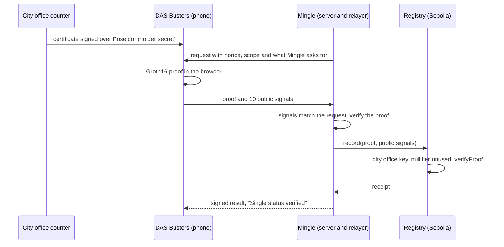

# DAS Busters

English | [日本語](README.ja.md)

DAS stands for Dating App Scam. DAS Busters lets you show a dating app that you are single, and nothing else: not your name, not your birth date, not your 本籍 (registered domicile).

Built at ETHGlobal Tokyo 2026. [Live demo](https://das-busters.vercel.app) · [Explainer with diagrams](https://das-busters.vercel.app/how-it-works) · [Demo script](docs/demo.md) · [Technical details](docs/technical.md)

## The problem

In Japan, the city office that keeps your family register issues a Single Status Certificate (独身証明書) for a few hundred yen. It lists your name, birth date and 本籍, and states that you can marry without breaching the Civil Code's ban on bigamy ([Koto City](https://www.city.koto.lg.jp/060303/dokusinsyoumei.html)). Marriage agencies and marriage-focused dating services ask for it today. youbride wants a photo of the whole certificate with nothing hidden, issued in the last 3 months ([youbride help](https://support.youbride.jp/hc/ja/articles/7335924102809)); IBJ wants the original, also from the last 3 months ([IBJ](https://www.ibjapan.com/marriage/p_6101/)). To show one fact, you hand a company you just joined your full name, birth date and 本籍.

Users want the check: in a 2024 Tapple survey of 5,429 users, 83.8% of men and 97.4% of women wanted some proof that the other person is single ([Digital Agency](https://digital-agency-news.digital.go.jp/articles/2025-10-17)). Of the 5,645 social-media romance scams the National Police Agency counted in 2025, 1,846 (32.7%) started on a matching app, more than on any other channel ([NPA](https://www.npa.go.jp/bureau/safetylife/sos47/new-topics/260605/01.html)).

## How it works

DAS Busters is for people on dating apps, and for apps that want checked single status without keeping family-register data.

1. At the issuing counter, the city office signs a certificate bound to a commitment to your holder key. The key comes from one signature by your Google-linked Privy wallet, and the certificate and key stay on your phone.
2. A dating app (Mingle, our sample) asks for proof. You pick what to share: single (required), lives in Tokyo, and in your 30s, meaning born 1987–1996. The birth year itself stays hidden.
3. Your phone makes a Groth16 proof in the browser. Its nullifier is the same every time you prove to Mingle and different at any other app.
4. Mingle's server checks the proof against its request. Its relayer then records the nullifier on Ethereum Sepolia, where the registry verifies the proof again and refuses a nullifier it has seen. One certificate backs one account in that app's scope, and anyone can check.
5. Optionally, the wallet adds a World ID proof-of-human check, so Mingle also learns that a person approved a World ID request.

Japan already has a digital route: Tapple's かんたん独身証明 gets marital status through Mynaportal, and the app keeps your verified identity next to it ([more](docs/technical.md#japans-digital-route)).



The full sequence, with every API route and the server fallback, is in [docs/technical.md](docs/technical.md#how-it-fits-together).

## Try it

Any Google account works, and there is nothing to install.

1. Open [das-busters.vercel.app](https://das-busters.vercel.app) and click **Issuing counter**.
2. Under the QR code, click **No phone? Continue on this computer** on a laptop, or tap **Receive it on this phone** on a phone. With two devices, scan the laptop's QR code with your phone's camera and continue on the phone.
3. Tap **Continue with Google**, then **Save certificate**.
4. Tap **Verify single status on Mingle**. In Mingle, tap **Verify with DAS Busters**, then **Continue**.
5. Choose what to share and tap **Share selected information**. The proof is made in your browser, then Mingle checks it and records it on Sepolia.
6. On Mingle's profile, tap **What Mingle received ›**. It lists what Mingle got, what it did not, and links to the Sepolia transaction.

The human check is optional: **Verify with World ID** on the DAS Busters home screen runs on World ID staging with the World ID Simulator, so you need no World App. To start over, open [/reset](https://das-busters.vercel.app/reset). Every screen is in English and Japanese (the EN / 日本語 toggle, or `?lang=ja`). [docs/demo.md](docs/demo.md) is the step-by-step script, with what to do when something goes wrong.

## What is real and what is a stand-in

The proof, the contracts, Google sign-in and the World ID request are real. Our server plays the city office and Mingle's backend.

| Part | In this demo |
|---|---|
| Zero-knowledge proof | Real. A circom circuit, Groth16 on BN254, proved in your browser. The server proves only if the phone cannot finish, and the button says so. |
| Blockchain | Real contracts on Ethereum Sepolia, a public testnet, source verified on Sourcify. |
| Google sign-in | Real, through Privy. The embedded wallet signs one message to derive your holder key and never sends a transaction. |
| Human check | A real World ID request (IDKit 4), checked by World's Developer Portal on staging and approved with a test identity in the World ID Simulator. |
| City office | Stand-in. Our server signs with a demo EdDSA key kept in a Vercel environment variable, for the demo only. |
| Certificate | Stand-in data, real signature. Every pickup issues fictional Shibuya resident Ken Sato's certificate, bound to your own holder key. |
| Mingle | Stand-in app. Our server plays its backend: the verifier and the relayer. |

The hub shows four badges for the parts that can run as a stand-in. On the live demo they read `Sign-in: Google via Privy`, `Proof: Groth16`, `Recorded on Sepolia` and `Human check: World ID staging`; a badge saying mock, off-chain or simulated marks a stand-in. The World ID staging window closes on 27 September 2026 at 16:58 JST, and after that the human check is labelled simulated. How a real deployment would split these roles: [Demo setup vs a real deployment](docs/technical.md#demo-setup-vs-a-real-deployment).

## Technical highlights

- The circuit ([circuits/single_proof.circom](circuits/single_proof.circom)) has 9,921 constraints. It checks the city office's EdDSA-Poseidon signature over the certificate fields and Poseidon(holder secret), that the certificate says single, and the residence and birth-year range only when shared.
- The nullifier is `Poseidon(holderSecret, scopeHash)`. The city office only sees `Poseidon(holderSecret)`, so when the phone makes the proof, the office cannot compute your nullifier and find you on Mingle ([lib/fields.ts](lib/fields.ts)).
- Proving runs on the phone with snarkjs (2.7 MB wasm and 5.0 MB zkey, fetched when the share screen opens). `/api/prove` is a fallback, and the button names it ([lib/deviceProver.ts](lib/deviceProver.ts)).
- Hidden fields are forced to 0 and disclosure flags to 0 or 1, in the circuit and again in Mingle's verifier ([lib/verifier.ts](lib/verifier.ts)).
- The registry checks the issuer key, then the nullifier, then `verifyProof`, and stores only the nullifier. The relayer simulates first and waits up to 45 s for the receipt. A revert is shown as a failure; only RPC or relayer trouble falls back to a labelled off-chain check ([lib/chain.ts](lib/chain.ts)).
- The server picks every mode from env, and Mingle accepts only the prover the server runs, so a client cannot downgrade to the mock ([lib/modes.ts](lib/modes.ts)).
- The holder key is the SHA-256 of a Privy embedded-wallet signature over a fixed message, cut to 31 bytes to stay below the BN254 field ([lib/privy.ts](lib/privy.ts)).
- World ID uses IDKit 4's `proofOfHuman` preset. Our server signs each request and forwards each result to the Developer Portal's `/api/v4/verify` on staging ([World ID](docs/technical.md#world-id), [FEEDBACK.md](FEEDBACK.md)).

## Contracts on Sepolia

| Contract | Address | Source |
|---|---|---|
| SingleProofRegistry | [0xDc813EC37A689e9927A9AA35203EdACC4822c217](https://sepolia.etherscan.io/address/0xDc813EC37A689e9927A9AA35203EdACC4822c217) | [Sourcify (exact match)](https://repo.sourcify.dev/11155111/0xDc813EC37A689e9927A9AA35203EdACC4822c217) · [Blockscout](https://eth-sepolia.blockscout.com/address/0xDc813EC37A689e9927A9AA35203EdACC4822c217) |
| Groth16Verifier (generated by snarkjs) | [0x0400a2Ab2F4F3b13Bfe08FF3e063107DfF31D4E8](https://sepolia.etherscan.io/address/0x0400a2Ab2F4F3b13Bfe08FF3e063107DfF31D4E8) | [Sourcify (exact match)](https://repo.sourcify.dev/11155111/0x0400a2Ab2F4F3b13Bfe08FF3e063107DfF31D4E8) · [Blockscout](https://eth-sepolia.blockscout.com/address/0x0400a2Ab2F4F3b13Bfe08FF3e063107DfF31D4E8) |

Blockscout decodes the registry's `record` calls and `SingleStatusVerified` events; Etherscan shows the same data as raw hex. The nullifier is the event's first indexed topic. To check one yourself (this returns `true`):

```sh
cast call 0xDc813EC37A689e9927A9AA35203EdACC4822c217 'used(uint256)(bool)' \
  0x290f3683289a58f9ec1166b55cf29189eebe531b7ad27d736a56bc2dbfea94e7 \
  --rpc-url https://ethereum-sepolia-rpc.publicnode.com
```

## Tests

Of the 23 circuit tests, 13 show the circuit itself refusing a tampered certificate, someone else's key or values in hidden fields. There are also 24 unit tests, 13 Foundry tests against the real generated verifier and a real proof, and an end-to-end smoke test of the API. Each attack and the test that refuses it: [docs/technical.md](docs/technical.md#tests).

```sh
npm test                                              # unit and circuit tests
git submodule update --init && npm run test:contracts # Foundry
BASE_URL=https://das-busters.vercel.app npm run smoke # the API end to end
```

## Limits

- The trusted setup has one local contribution per phase, because the Hermez ptau mirrors returned 403 at the event.
- Freshness and revocation are not checked. The issue date is signed into the certificate, but checking it needs a new circuit key and a redeploy.
- The app chooses its scope, and the registry does not check it. In the demo, Reset gives Mingle a new epoch and so a new nullifier.
- World ID is not bound to the certificate or the proof, and its nullifier is not checked for repeats.
- The city office's signing key sits on the demo server, and one `TOKEN_SECRET` signs the tokens of every role.
- The counter hands the sample certificate to anyone who scans. A real city office would check ID first.
- A request is not single-use: within its 10 minutes the same proof verifies again off-chain. On-chain the nullifier is still recorded once.

Who enforces each rule, and the rest of the demo shortcuts: [Security model and limits](docs/technical.md#security-model-and-limits).

## Made before the event

This existed before hacking started:

- Idea and pitch: the idea, the pitch deck and the problem research.
- Screen designs: Figma mockups of every screen, plus a clickable front-end mock we used to film the pitch.
- Technical spike: a local prototype to check that a circom proof could be generated and verified on a local chain.
- Brand assets: the DAS Busters logo, the Mingle icon and the sample profile photo.

None of the earlier code is in this repository. We used the mockups as the visual reference. All code in this repository was written during the event; the brand assets above and two public skill files from ethskills.com ([AI_USAGE.md](AI_USAGE.md)) are the exceptions.

## AI usage

We used Claude Code throughout the build. [AI_USAGE.md](AI_USAGE.md) lists what it did, area by area, and what the team did.

## Run locally

```sh
npm install
npm run dev
```

Needs Node 22 or later. Open http://localhost:3000. With no `.env.local`, every integration falls back to its mock and the hub badges say so; the key names are in [.env.example](.env.example). Real proofs locally, the contract tests, testing from a phone on the LAN and rebuilding the circuit: [docs/technical.md](docs/technical.md#running-locally). Deployment and outside services: [docs/setup.md](docs/setup.md).

## License

GPL-3.0: see [LICENSE](LICENSE). The Groth16 verifier and the prover come from snarkjs, which is GPL-3.0. Files with their own SPDX header, such as the MIT registry contract, keep it, so the source stays identical to what is verified on Sourcify.
