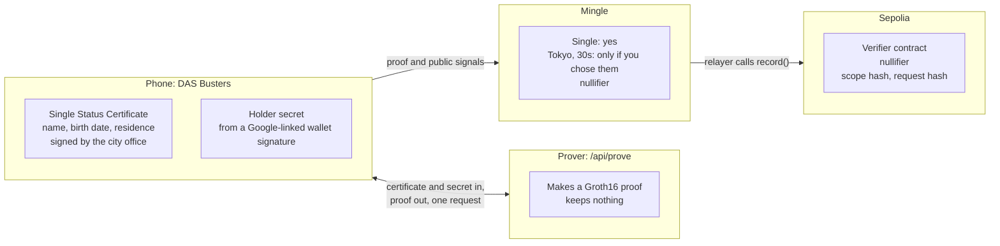
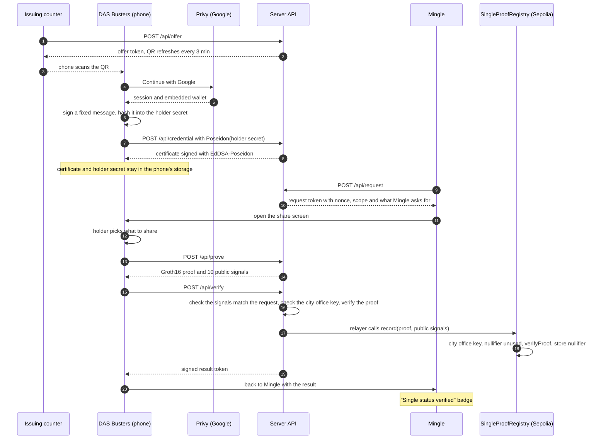
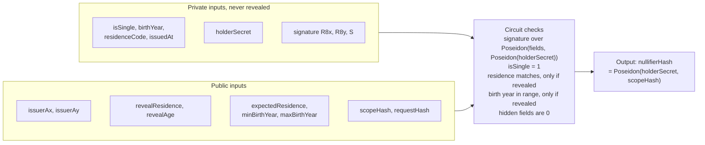
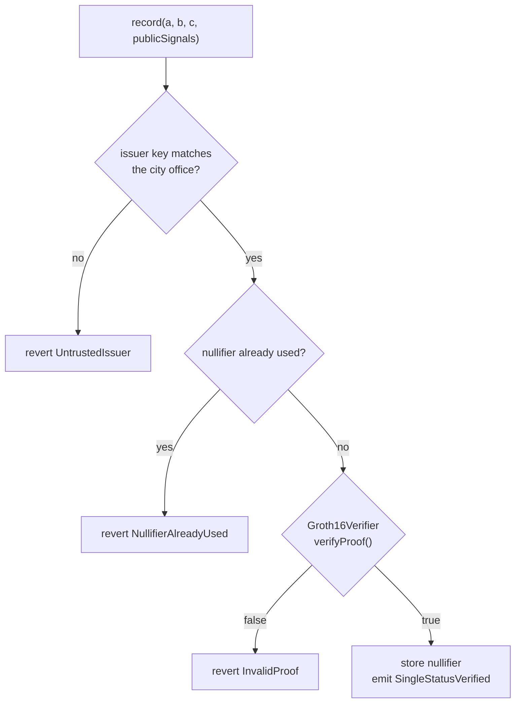

# DAS Busters

English | [日本語](README.ja.md)

Show a dating app that you are single, and nothing else.

Built at ETHGlobal Tokyo 2026.

**Try it**: [single-proof.vercel.app](https://single-proof.vercel.app) · [Demo walkthrough](docs/demo.md), step by step with what to click and what to say.

## The problem

People on dating apps lie about being single. An official certificate from the city office would settle it. But sending a copy to a dating app hands over your full name, birth date and address to a company you just met.

## What we are building

- **Issuing counter**: the city office screen shows a QR code. Scanning it puts a signed Single Status Certificate on your phone.
- **DAS Busters**: a wallet that keeps the certificate on your phone. When an app asks, you pick what to prove:
  - that you are single (required)
  - that you live in Tokyo (optional)
  - that you are in your 30s (optional)
- **Mingle**: a sample dating app. It checks the proof and shows a "Single status verified" badge on your profile.

The proof is a zero-knowledge proof (circom, Groth16). Ethereum stores only the verifier contract and one nullifier per verification. No personal data goes on-chain.

## Where the data lives

The certificate never leaves the phone except for the one proving request. Mingle gets a yes/no answer and a nullifier. Sepolia stores the nullifier and two hashes. The transaction input also carries the public signals: the city office key, plus the Tokyo code and birth-year range only if you chose to share them.



## How it fits together

All three screens run from one Next.js app. The API routes play the city office, the prover and Mingle's backend.



## Language

The UI is in English by default. An EN / 日本語 toggle on the hub, the counter, the wallet home and Mingle's Settings switches it to Japanese, and the choice applies to every app on that device. Adding `?lang=ja` to any URL does the same, and the counter's QR code carries its language over to the phone.

## Status

We are building this during the hackathon. The build plan is in [docs/plan.md](docs/plan.md) (Japanese).

Live demo: https://single-proof.vercel.app

| Piece | State |
|---|---|
| Demo hub and routes | done |
| Screens and full flow with a mock prover | done |
| Zero-knowledge proof (circom, Groth16, proved on the server) | done |
| On-chain verification on Sepolia | done |
| Google sign-in through Privy, holder key from the embedded wallet | done |
| English and Japanese UI | done |
| World ID | planned |

## Made before the event

The ETHGlobal rules ask us to separate earlier work from event work. This existed before hacking started:

- **Idea and pitch**: the idea, the pitch deck and the problem research.
- **Screen designs**: Figma mockups of every screen, plus a clickable front-end mock we used to film the pitch.
- **Technical spike**: a local prototype to check that a circom proof could be generated and verified on a local chain.
- **Brand assets**: the DAS Busters logo, the Mingle icon and the sample profile photo.

None of the earlier code is in this repository. We used the mockups as the visual reference. Everything in this repository was written during the event.

## How the proof works

- **Circuit**: [circuits/single_proof.circom](circuits/single_proof.circom), 9,921 constraints.
- **What it checks**
  - The city office's EdDSA-Poseidon signature over the certificate and the holder's commitment.
  - Single status.
  - Optionally, residence and a birth-year range.
- **What it outputs**: a nullifier per holder and verifier scope.
- **Where the proof is made**: currently on the server (`/api/prove`, about 1 to 4 seconds on Vercel). The phone sends its certificate for that one request; nothing is stored. Moving the prover onto the phone is the next step for privacy.
- **Trusted setup**: one local contribution, because the public ptau mirrors were unavailable. This is fine for a demo, not for production.



The public signals come out as `nullifierHash` followed by the nine public inputs in the order above. [lib/presentation.ts](lib/presentation.ts) and the registry both rely on that order. The same holder gets the same nullifier at Mingle, which is how the registry stops a second account on one certificate. `requestHash` ties each proof to one request, so a proof cannot be replayed.

## Contracts on Sepolia

| Contract | Address |
|---|---|
| SingleProofRegistry | [0xDc813EC37A689e9927A9AA35203EdACC4822c217](https://sepolia.etherscan.io/address/0xDc813EC37A689e9927A9AA35203EdACC4822c217) |
| Groth16Verifier (generated by snarkjs) | [0x0400a2Ab2F4F3b13Bfe08FF3e063107DfF31D4E8](https://sepolia.etherscan.io/address/0x0400a2Ab2F4F3b13Bfe08FF3e063107DfF31D4E8) |

- **What gets recorded**: after Mingle checks a proof, its relayer calls `record`. The registry checks the city office key, verifies the proof, and stores only the nullifier. It emits the nullifier, the scope and the request hash.
- **One account per certificate**: a second account made with the same certificate is rejected.
- **Source**: [contracts/](contracts/). Run the tests with `cd contracts && forge test`; they use a real proof.



A revert shows up in Mingle as a failure. Mingle falls back to an off-chain check only when Sepolia cannot be reached, and it says so on screen.

## AI usage

We used Claude Code throughout the build. [AI_USAGE.md](AI_USAGE.md) lists what it did, area by area, and what the team did.

## Run locally

```sh
npm install
npm run dev
```

Open http://localhost:3000. The dev server listens on all interfaces, so a phone on the same Wi-Fi can open `http://<your-ip>:3000`.
