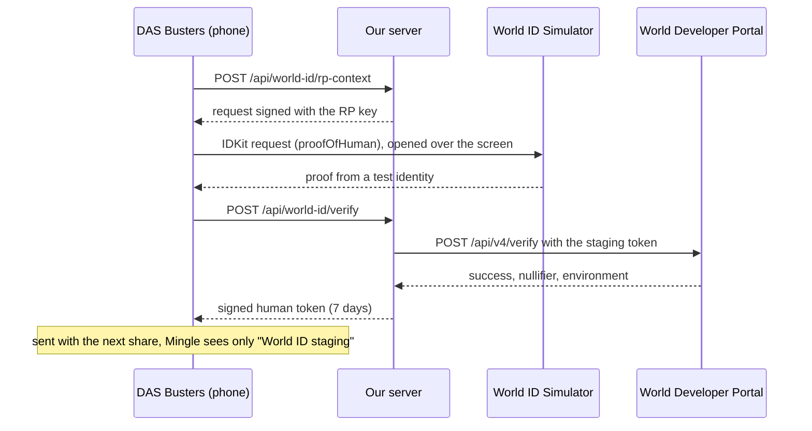
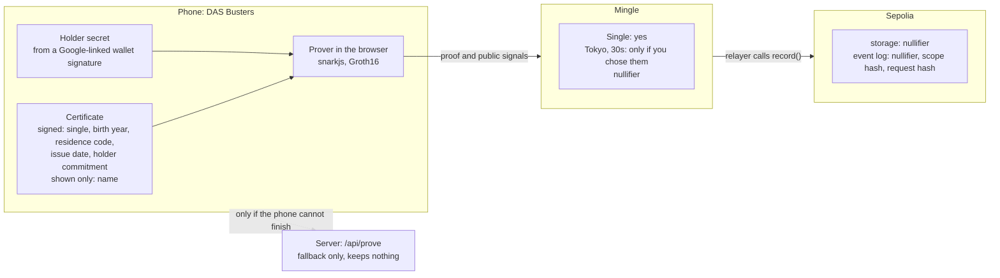
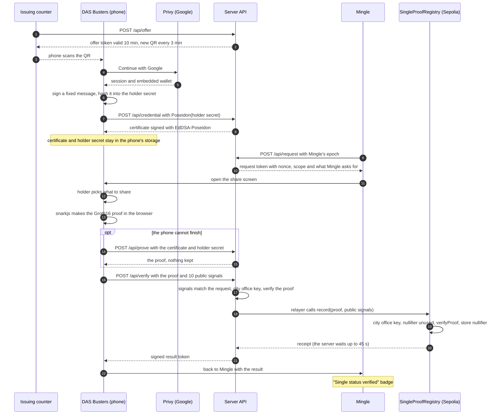
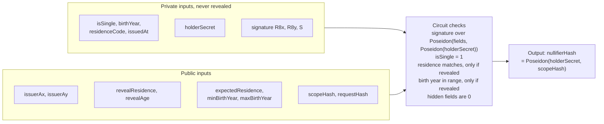
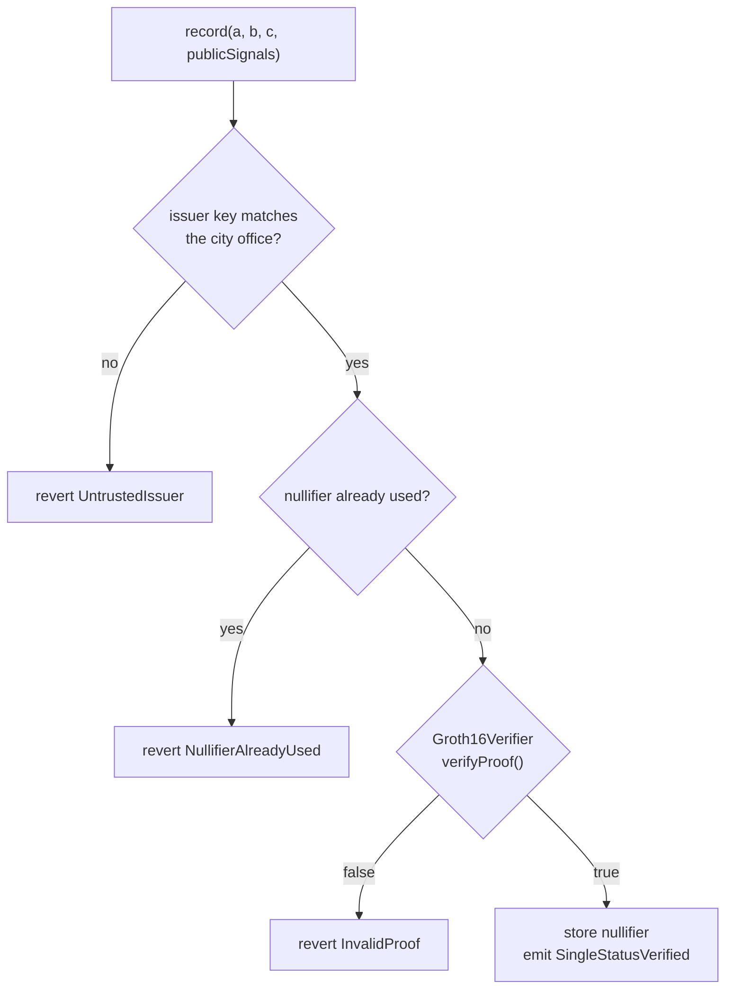

# DAS Busters

English | [日本語](README.ja.md)

Show a dating app that you are single, and nothing else.

Built at ETHGlobal Tokyo 2026. **Live demo**: [das-busters.vercel.app](https://das-busters.vercel.app) · **Explainer with diagrams**: [/how-it-works](https://das-busters.vercel.app/how-it-works) · **Demo script**: [docs/demo.md](docs/demo.md)

In Japan, the city office that keeps your family register issues a Single Status Certificate (独身証明書) for a few hundred yen. It lists your name, birth date and registered domicile (本籍), and states that you can marry without breaching the Civil Code's ban on bigamy ([Koto City](https://www.city.koto.lg.jp/060303/dokusinsyoumei.html)). Marriage agencies and marriage-focused dating services ask for it today. youbride wants a photo of the whole certificate with nothing hidden, issued in the last 3 months ([youbride help](https://support.youbride.jp/hc/ja/articles/7335924102809)); IBJ wants the original, also from the last 3 months ([IBJ](https://www.ibjapan.com/marriage/p_6101/)). Users want the check: in a 2024 Tapple survey of 5,429 users, 83.8% of men and 97.4% of women wanted some proof that the other person is single ([Digital Agency](https://digital-agency-news.digital.go.jp/articles/2025-10-17)). Of the 5,645 social-media romance scams the National Police Agency counted in 2025, 1,846 (32.7%) started on a matching app, more than on any other channel ([NPA](https://www.npa.go.jp/bureau/safetylife/sos47/new-topics/260605/01.html)).

The catch is the photo: to show one fact, you hand a company you just joined your full name, birth date and 本籍.

DAS Busters is for people on dating apps, and for apps that want checked single status without keeping family-register data. The city office signs a digital certificate that stays on your phone. The app (Mingle, our sample) gets a zero-knowledge proof that you are single, plus "lives in Tokyo" or "in your 30s" only if you choose to share them. Zero-knowledge, because a copy or a signed credential would give away more than that one fact. The app also gets a nullifier, a number that is the same each time you prove to that app. A contract on Ethereum Sepolia records it in public, so anyone can check that one certificate backs one account there. In this demo our server plays the city office and Mingle, and every pickup issues the certificate of a fictional resident; the proof, the contracts, Google sign-in and the World ID request are real.

## Try it in 3 minutes

Any Google account works, and there is nothing to install.

**One device** (a laptop, or a phone on its own):

1. Open [das-busters.vercel.app](https://das-busters.vercel.app) and click **Issuing counter**.
2. On a laptop, click **No phone? Continue on this computer** at the bottom left. On a phone, tap **Receive it on this phone** under the QR code.
3. Tap **Continue with Google**, then **Save certificate**.
4. Tap **Verify single status on Mingle**. In Mingle, tap **Verify with DAS Busters**, then **Continue**.
5. Choose what to share and tap **Share selected information**. The proof is made in your browser, then Mingle checks it and records it on Sepolia.
6. On Mingle's profile, tap **What Mingle received ›**. It lists what Mingle got, what it did not, and links to the Sepolia transaction.

**Two devices**: open the counter on a laptop, scan its QR code with your phone's camera, and continue from step 3 on the phone.

The optional human check is **Verify with World ID** on the DAS Busters home screen. It runs on World ID staging with the World ID Simulator, so you need no World App. To start over, open [/reset](https://das-busters.vercel.app/reset). [docs/demo.md](docs/demo.md) is the step-by-step demo script, with what to do when something goes wrong.

The hub shows four badges for the parts that can run as a stand-in. On the live demo they read `Sign-in: Google via Privy`, `Proof: Groth16`, `Recorded on Sepolia` and `Human check: World ID staging`. A badge that says mock, off-chain or simulated means that part is a stand-in.

## What it does

- **Issuing counter** (laptop or iPad): the city office screen shows a QR code. Scanning it gives your phone a Single Status Certificate signed by the city office.
- **DAS Busters** (phone): a wallet that keeps the certificate. When an app asks, you choose what to prove:
  - that you are single (required)
  - that you live in Tokyo (optional)
  - that you are in your 30s, meaning born 1987–1996 (optional). The birth year itself stays hidden.
- **Mingle** (phone): a sample dating app. The member already typed a city and an age on the profile, and Mingle asks the wallet to back them up ([lib/mingle.ts](lib/mingle.ts)). It checks the proof, shows **✓ Single status verified** on the profile, and its relayer records the nullifier on Ethereum Sepolia.

### Real vs stand-in

| Part | In this demo |
|---|---|
| City office | Stand-in. Our server plays it and signs with a demo EdDSA key kept in a Vercel environment variable. This is for the demo only; see [Demo setup vs a real deployment](#demo-setup-vs-a-real-deployment). |
| Certificate | Stand-in data with a real signature. Every pickup issues the certificate of Ken Sato, a fictional resident of Shibuya City, bound to your own holder key. |
| Mingle | Stand-in app. Our server plays its backend: the verifier and the relayer. |
| Zero-knowledge proof | Real: a circom circuit, Groth16 on BN254. It is made in your browser; only if the phone cannot finish does our server make it, and the button says so. |
| Blockchain | Real contracts on Ethereum Sepolia, a public testnet, with source verified on Sourcify. |
| Google sign-in | Real, through Privy. The embedded wallet signs one message to derive your holder key. It never sends a transaction. |
| Human check | A real World ID request (IDKit 4), checked by World's Developer Portal on staging and approved with a test identity in the World ID Simulator. |

## Why zero-knowledge

- A copy of the certificate hands over your name, birth date and 本籍 to show one fact.
- A "yes, single" signed by the city office for each app would tell the city office which apps you use, and the signed statements could link you across apps.
- A signed credential with selective disclosure (such as SD-JWT) hides the other fields, but every app sees the same issuer signature, which links you, and it cannot show "born 1987–1996" without showing the date.

The proof shows the fact and keeps the signature and the values hidden, and each app gets its own nullifier.

## Why a blockchain

Mingle's server checks each proof first, for a fast answer and a clear error. The registry contract then checks it again in public and refuses a nullifier it has already recorded. So "one account per certificate per app" is something anyone can check, and Mingle cannot delete a record afterwards. The limit is that the app chooses its scope: the registry does not check which scope a proof was made for, so an app that changes its scope gets new nullifiers. In the demo, Reset does exactly that.

## Japan already has a digital route

Since April 2025 the dating app Tapple offers かんたん独身証明. It reads the name, address and gender on your My Number Card to match your account, then gets your marital status from the family register through Mynaportal ([Digital Agency](https://digital-agency-news.digital.go.jp/articles/2025-10-17), [Tapple release](https://www.cyberagent.co.jp/news/detail/id=31851)). Every app that works this way ends up holding your verified identity next to your marital status.

DAS Busters gives the app one checked fact and a number that differs per app. The issuer does not have to be a city office counter: Mynaportal could sign the certificate instead of our demo city office, and the proof side would stay the same.

## World ID

The certificate proves civil status. It cannot tell whether one person is behind several Google accounts: each account gets its own holder key and so its own nullifier, and in this demo the counter hands a certificate to anyone who scans. World ID is there to add "a real person approved this".

**Why proof of human is the minimum.** We request IDKit's `proofOfHuman` preset ([app/wallet/world-id/IdkitRequest.tsx](app/wallet/world-id/IdkitRequest.tsx)). The certificate already covers civil status, residence and age, so World ID only needs to add personhood, and proof of human adds nothing else: no name, face or ID number. World describes the selfie check as a medium-assurance camera check ([World docs](https://docs.world.org/world-id/idkit/credentials)); it does not give the uniqueness this job needs. A passport or document credential would repeat what the city certificate proves and ask the user for more.

**What Mingle receives.** Only that a human check passed and which kind it was: World ID, World ID staging or simulated. Our server keeps the World ID nullifier inside the token it signs, and [app/api/verify/route.ts](app/api/verify/route.ts) passes Mingle only the environment.

**Without World ID.** The check is optional. Cancel the Simulator, or skip the check, and sharing works the same way; Mingle shows single status without the Human badge. [docs/demo.md](docs/demo.md#5b-without-world-id-optional) shows this path.

**Staging vs production.** This deployment runs World ID staging: our server signs each request (`/api/world-id/rp-context`) and forwards each result to the Developer Portal (`/api/world-id/verify`), and a test identity in the World ID Simulator approves it. Production would use World App and a real person. The code switches with `WORLDID_ENVIRONMENT`, but production is not set up. The screens say which one ran.

**The staging window.** The Portal accepts Simulator proofs only while a 24-hour staging window is open. The current window closes on **27 September 2026 at 16:58 JST**. After that the server labels the check simulated, the hub reads `Human check: simulated`, and the human check becomes a five-second camera stand-in.

**Current limits.** The World ID proof is not bound to the certificate or to the zero-knowledge proof (the request carries no signal), and the World ID nullifier is not checked for repeats. Today it shows that a person approved this World ID request, not that one person holds one account.



How the integration went, what slowed us down and what would help: [FEEDBACK.md](FEEDBACK.md).

## Where the data lives

The certificate and the holder secret stay on the phone, and the phone makes the proof. Only if it cannot finish (an old browser, too little memory) does it send them to `/api/prove` for that one proof; the button says so, and the server keeps nothing. Mingle gets a yes, anything you chose to share, and the nullifier. Sepolia stores only the nullifier; the event log carries the nullifier, the scope hash and the request hash. The transaction input carries the proof and its 10 public signals: the city office's public key, plus the Tokyo code (13) and the birth-year range only if you chose to share them. No name, birth date or address goes on-chain.



## How it fits together

One Next.js app on Vercel serves all three screens. Its API routes play the city office, the fallback prover and Mingle's backend. That is a demo shortcut, described in the next section.



## Demo setup vs a real deployment

In this demo one Next.js server on Vercel plays three parties: the city office, which holds the issuer's EdDSA signing key in an environment variable (`ISSUER_PRIVATE_KEY`); the fallback prover; and Mingle's backend, the verifier and the relayer. All three sign their tokens with one shared `TOKEN_SECRET`. This is a shortcut so the whole flow runs from one URL. It is not how these parties would trust each other, and a city office's signing key would never sit on an app server.

| Part | This demo | A real deployment (intended design, not built) |
|---|---|---|
| City office (issuer) | An API route on the demo server; the signing key is a Vercel environment variable | Run by the municipality, or through the national family-register system or Mynaportal. The signing key stays in the office's own hardware security module, and its public key is published in a list of trusted issuers. |
| Wallet (DAS Busters) | Web pages on the same site as Mingle; the certificate and holder key sit in the browser's localStorage | Its own app or origin, with keys in the phone's secure storage |
| Prover | On the phone by default; the demo server makes the proof only if the phone cannot | On the phone only |
| Mingle's verifier | An API route on the same server, sharing one token secret with the other roles | Mingle's own backend with its own keys, and one fixed scope per app so the nullifier never changes |
| Recording | Sepolia testnet; the demo server's relayer pays the fee | A public mainnet or L2. Mingle (or the wallet) sends the transaction, and the contract checks the proof against the trusted-issuer list by proving membership in a set, for example a Merkle root of city keys, so the proof does not reveal which city. |
| Human check | World ID staging with the Simulator | World ID in production (World App), bound to this proof, with its nullifier checked for repeats |
| Freshness and revocation | Not checked | Mingle asks for an "issued on or after" date as a public input, and the issuer publishes revocations |

## How the proof works

- **Circuit**: [circuits/single_proof.circom](circuits/single_proof.circom), 9,921 constraints.
- **What it checks**
  - The city office's EdDSA-Poseidon signature over the certificate values and the holder's commitment, Poseidon(holder secret).
  - Single status.
  - Optionally, residence and a birth-year range.
- **What it outputs**: a nullifier per holder and verifier scope.
- **Where the proof is made**: in the browser, with snarkjs and the same circuit files the server uses ([lib/deviceProver.ts](lib/deviceProver.ts); `single_proof.wasm` 2.7 MB and `single_proof.zkey` 5.0 MB). The share screen starts downloading them when it opens. On a laptop in Chrome the proof itself took under a second once the files were cached; we have not measured phones yet. If the phone cannot finish, `/api/prove` makes that one proof and the button says "This phone could not finish. Creating the proof on the DAS Busters server…". A broken rule (not single, someone else's certificate, an edited certificate) is an answer and is never retried on the server. `PROVE_ON=server` moves proving back to the server; the mock prover always runs there.
- **Trusted setup**: the Hermez ptau mirrors returned 403 at the event, so both phases have one local contribution ([circuits/build.sh](circuits/build.sh)). That is fine for a demo, not for production. PSE Perpetual Powers of Tau is reachable, and moving to it is the next step.



The public signals come out as `nullifierHash` followed by the nine public inputs in the order above. [lib/presentation.ts](lib/presentation.ts) and the registry both rely on that order. The same holder gets the same nullifier in the same Mingle scope, which is how the registry refuses a second account on one certificate. `requestHash` ties each proof to one Mingle request, so it cannot be reused for a different request. The server does not mark a request as used, so within its 10 minutes the same proof verifies again off-chain; on Sepolia its nullifier is still recorded only once.

## Contracts on Sepolia

| Contract | Address | Source |
|---|---|---|
| SingleProofRegistry | [0xDc813EC37A689e9927A9AA35203EdACC4822c217](https://sepolia.etherscan.io/address/0xDc813EC37A689e9927A9AA35203EdACC4822c217) | [Sourcify (exact match)](https://repo.sourcify.dev/11155111/0xDc813EC37A689e9927A9AA35203EdACC4822c217) · [Blockscout](https://eth-sepolia.blockscout.com/address/0xDc813EC37A689e9927A9AA35203EdACC4822c217) |
| Groth16Verifier (generated by snarkjs) | [0x0400a2Ab2F4F3b13Bfe08FF3e063107DfF31D4E8](https://sepolia.etherscan.io/address/0x0400a2Ab2F4F3b13Bfe08FF3e063107DfF31D4E8) | [Sourcify (exact match)](https://repo.sourcify.dev/11155111/0x0400a2Ab2F4F3b13Bfe08FF3e063107DfF31D4E8) · [Blockscout](https://eth-sepolia.blockscout.com/address/0x0400a2Ab2F4F3b13Bfe08FF3e063107DfF31D4E8) |

- **Source verification**: both contracts match the source in [contracts/src/](contracts/src/) exactly on Sourcify. Blockscout shows the registry's source and decodes its `record` calls and `SingleStatusVerified` events. Etherscan verification is pending, so Etherscan still shows raw hex.
- **What gets recorded**: after Mingle checks a proof, its relayer calls `record`. The registry checks the city office key, checks that the nullifier is unused, verifies the proof, and stores only the nullifier. It emits the nullifier, the scope hash and the request hash.
- **One account per certificate per scope**: a second record with the same nullifier reverts. In the demo, Mingle's browser keeps the epoch that sets the scope, so Reset starts a new one; a real Mingle would fix its scope.
- **Check a nullifier yourself**: the nullifier is the first indexed topic of the event, in hex or decimal. For example, this returns `true`:

```sh
cast call 0xDc813EC37A689e9927A9AA35203EdACC4822c217 'used(uint256)(bool)' \
  0x290f3683289a58f9ec1166b55cf29189eebe531b7ad27d736a56bc2dbfea94e7 \
  --rpc-url https://ethereum-sepolia-rpc.publicnode.com
```



A revert shows up in Mingle as a failure. Mingle falls back to an off-chain check only when recording fails for another reason, such as Sepolia being unreachable or the relayer running out of test ETH, and it says so on screen.

## Security model and limits

What each check relies on, and what is not enforced yet:

| Rule | Enforced by |
|---|---|
| The city office signed these values together with this holder's commitment | Circuit (EdDSA-Poseidon) |
| The signing key is the city office's key | Mingle's verifier and the registry (`UntrustedIssuer`); the circuit takes the key as a public input |
| The certificate says single | Circuit (`isSingle === 1`) |
| The person proving holds the holder secret | Circuit (the commitment is inside the signed message) |
| A shared residence or birth-year range matches what Mingle asked for | Circuit, and Mingle's verifier compares the values with its request |
| Hidden values are 0, and disclosure flags are 0 or 1 | Circuit and Mingle's verifier |
| The proof answers this Mingle request | Mingle's verifier (scope hash and request hash). The registry only verifies the proof; it does not check the scope. |
| Every public signal is below the field modulus | snarkjs `verify` and the generated Solidity verifier |
| A nullifier is recorded once | Registry |
| A request is answered only once | Not yet. Requests are stateless, so within their 10 minutes the same proof verifies again off-chain; on-chain the nullifier is still recorded once. |
| The certificate is recent | Not yet. Real verifiers such as IBJ and youbride accept only certificates issued in the last 3 months. The issue date is already signed into the certificate, so Mingle could send an "issued on or after" date as a public input. That needs a new circuit key and a contract redeploy, so it is the next step, not part of this demo. |
| Revocation | Not yet. The issuer would publish revocations. |
| One fixed scope per app | Not yet. In the demo the epoch comes from Mingle's browser, and Reset gives a new epoch and so a new nullifier. |
| World ID is tied to this proof and deduplicated | Not yet. The World ID proof is not bound to the certificate or the proof, and its nullifier is not checked for repeats. |
| Only Mingle's relayer records | Not enforced. `record()` is open to anyone, since the proof is the authorisation. A copied pending call could land first; our relayer's transaction then reverts and Mingle shows an error. |

Demo shortcuts that a real deployment would not have:

- One `TOKEN_SECRET` signs every token for every role: offers, requests, results and human checks ([lib/token.ts](lib/token.ts)).
- The wallet and Mingle share one origin, so they share one browser storage and keep to separate key prefixes ([lib/storage.ts](lib/storage.ts)).
- The counter hands Ken's certificate to anyone who scans. A real city office would check ID first.
- When the server fallback prover is used, it sees the certificate and the holder secret for that one request. The mock prover mode always proves on the server.
- The trusted setup has one local contribution per phase (see [How the proof works](#how-the-proof-works)).
- The issuer key is a public signal. With one city office that reveals nothing new; once many offices issue certificates, it would reveal which city issued yours. Proving membership in a set of trusted keys would hide it.
- The circuit range-checks the birth year to 16 bits but not the range bounds; Mingle's verifier requires the bounds to equal the ones it asked for.

## Design decisions

- **Prove on the phone, with a labelled server fallback.** The plan put proving on the server, following a mentor's advice and the pre-event prototype ([docs/plan.md](docs/plan.md)). On 26 September we moved it into the browser so the certificate and holder secret stay on the phone. The cost is a 7.7 MB download and phone speed we have not measured, so `/api/prove` stays as a fallback that the button names ([lib/deviceProver.ts](lib/deviceProver.ts), [app/wallet/share/ShareScreen.tsx](app/wallet/share/ShareScreen.tsx), `PROVE_ON` in [lib/modes.ts](lib/modes.ts)).
- **Nullifier from the holder secret.** `nullifier = Poseidon(holderSecret, scopeHash)`. The city office only ever sees `Poseidon(holderSecret)`, so it cannot compute your nullifier and find you on Mingle. In this demo the fallback prover runs on the same server, so this holds only when the phone makes the proof. Trade-off: the secret has to be available every time you prove ([lib/fields.ts](lib/fields.ts), [circuits/single_proof.circom](circuits/single_proof.circom)).
- **Uniqueness keyed on the nullifier, not the proof.** A Groth16 proof can be changed into different bytes for the same statement, so the registry marks `used[nullifierHash]` and never a proof hash. Trade-off: uniqueness is only as stable as the scope ([contracts/src/SingleProofRegistry.sol](contracts/src/SingleProofRegistry.sol)).
- **Hidden values are forced to 0.** The circuit requires the residence and age values to be 0 when their flag is off, and Mingle's verifier refuses a hidden field with a value, so a hidden field cannot carry a value that could be read as shared. Trade-off: the flags themselves are public, so the transaction shows which facts were shared ([lib/verifier.ts](lib/verifier.ts)).
- **The server picks the mode.** Each integration has a mock and a real mode chosen from env, and Mingle's verifier accepts only the prover the server runs, so a client cannot downgrade a real deployment to the mock. The pre-event prototype let the client send `bypass:true`. Trade-off: a missing env var means mock, so the hub, the share screen and Mingle show mode badges ([lib/modes.ts](lib/modes.ts), `verifyProof` in [lib/prover.ts](lib/prover.ts)).
- **A revert is a failure.** The relayer simulates `record()` first, and a revert (nullifier used, untrusted issuer, invalid proof) reaches the user as an error. Only RPC or relayer problems fall back to an off-chain check, and the screen says so. The prototype rounded reverts into "off-chain success" ([lib/chain.ts](lib/chain.ts)).
- **Wait for the receipt.** The plan was to return the transaction hash at once. The code waits up to 45 seconds for the receipt, so a result never says "recorded" for a transaction that later reverts. Trade-off: sharing takes one Sepolia block longer ([lib/chain.ts](lib/chain.ts)).
- **A relayer pays gas.** Users need no ETH and no crypto wallet of their own. Trade-off: one funded demo key pays for everyone ([docs/setup.md](docs/setup.md#relayer-gas)).
- **Holder key from a Privy embedded-wallet signature.** Signing one fixed message gives a secret tied to the Google account, with no seed phrase to write down. The SHA-256 of the signature is cut to 31 bytes so it stays below the BN254 field; the prototype's 256-bit secret overflowed it. The stored value is treated as authoritative in case signatures are not deterministic. Trade-off: the key depends on Privy and the Google account ([lib/privy.ts](lib/privy.ts), [app/wallet/_components/holderKey.ts](app/wallet/_components/holderKey.ts)).
- **Stateless signed tokens.** Offers, requests, results and human checks are short-lived HS256 tokens, so the server needs no database on Vercel. Trade-off: a request is not marked used ([lib/token.ts](lib/token.ts)).
- **Lessons from the pre-event spike** ([docs/plan.md](docs/plan.md), section "プロトタイプの穴を繰り返さない"): the client could bypass the human check; reverts were rounded into success; the issuer seed was committed (now only the public key is in the repository, [lib/zk/issuer-public.json](lib/zk/issuer-public.json)); results were not tied to a request (now a nonce is); the holder secret overflowed the field; and the UI said data stayed on the device while the server made the proof.

## What we tested

```sh
npm test                                              # unit tests and circuit tests
npm run test:circuit                                  # the circuit alone: refusals at witness level, then one full prove and verify
git submodule update --init && npm run test:contracts # Foundry, against a real proof
BASE_URL=https://das-busters.vercel.app npm run smoke # the API end to end, including refusals
```

Smoke against a deployment with `CHAIN_MODE=sepolia` sends one Sepolia transaction. The repeat it tries next is refused in simulation and never sent.

| Attack | Refused by | Test |
|---|---|---|
| A certificate the city office signed as not single | Circuit (`isSingle === 1`) | [scripts/circuit-test.ts](scripts/circuit-test.ts) |
| An edited birth year or residence | Circuit (signature check) | circuit-test.ts; smoke "an edited certificate cannot prove" ([scripts/smoke.ts](scripts/smoke.ts), refused by the server prover's signature pre-check) |
| Someone else's certificate (wrong holder secret) | Circuit (signature over the holder commitment) | circuit-test.ts; smoke "someone else's secret cannot prove" (refused by the prover's pre-check) |
| An issuer key that did not sign the certificate | Circuit | circuit-test.ts |
| A birth year outside the revealed range, or a revealed residence that differs | Circuit | circuit-test.ts |
| A value in a hidden field, or a disclosure flag of 2 | Circuit and Mingle's verifier | circuit-test.ts; [scripts/unit-test.ts](scripts/unit-test.ts) |
| A public signal changed after proving | Groth16 verification, off-chain and on-chain | circuit-test.ts; `test_RevertWhen_DisclosedValueIsChanged`; smoke "tampered signals are rejected" (refused by Mingle's request check) |
| A proof relabelled as a mock proof | Mingle's verifier | circuit-test.ts |
| A proof point changed | Solidity verifier (`InvalidProof`) | `test_RevertWhen_ProofPointIsChanged` |
| A proof reused for another request or scope | Mingle's verifier (`wrong-request`); the registry through `verifyProof` | smoke "a proof cannot be replayed on another request"; `testFuzz_RevertWhen_RequestHashDiffers`, `testFuzz_RevertWhen_ScopeDiffers` (1,000 fuzz runs each) |
| A second account with the same certificate in the same scope | Registry (`NullifierAlreadyUsed`) | `test_RevertWhen_NullifierIsReused`; smoke "one certificate backs one account per epoch" (Sepolia mode only) |
| A failed attempt that uses up the nullifier | Registry (stores only after `verifyProof`) | `test_FailedAttemptDoesNotBurnTheNullifier` |
| A certificate from an untrusted issuer | Mingle's verifier and the registry (`UntrustedIssuer`) | circuit-test.ts; `test_RevertWhen_IssuerIsNotTrusted` |
| A World ID claim without the server's token | `/api/verify` | smoke "a World ID claim without the server's token is refused" |
| A fake pickup QR code | `/api/credential` | smoke "a fake QR code is rejected" |

The Foundry tests are in [contracts/test/SingleProofRegistry.t.sol](contracts/test/SingleProofRegistry.t.sol). They run against the real generated verifier and a real proof.

## Made before the event

This existed before hacking started:

- **Idea and pitch**: the idea, the pitch deck and the problem research.
- **Screen designs**: Figma mockups of every screen, plus a clickable front-end mock we used to film the pitch.
- **Technical spike**: a local prototype to check that a circom proof could be generated and verified on a local chain.
- **Brand assets**: the DAS Busters logo, the Mingle icon and the sample profile photo.

None of the earlier code is in this repository. We used the mockups as the visual reference. All code in this repository was written during the event; the brand assets above and two public skill files from ethskills.com ([AI_USAGE.md](AI_USAGE.md)) are the exceptions.

## What works today

On the live demo, [das-busters.vercel.app](https://das-busters.vercel.app):

- The counter issues a certificate signed with EdDSA-Poseidon, bound to a holder key derived from a Google sign-in through Privy.
- The phone makes a Groth16 proof of single status, with Tokyo and the 30s range as optional extras, and falls back to the server only when it cannot finish.
- Mingle verifies the proof, and its relayer records the nullifier on Sepolia; a second account in the same scope is refused on-chain.
- The World ID human check runs on staging with the Simulator until 27 September 2026 16:58 JST, and after that as a labelled simulated check.
- Every screen is in English and Japanese.
- Unit, circuit, contract and end-to-end smoke tests, listed above.

Not built yet: the freshness and revocation checks, a multi-party trusted setup, a fixed scope per app, binding World ID to the proof, separate keys per party, and a real city office key with a real family-register lookup. The build plan written before the event is in [docs/plan.md](docs/plan.md) (Japanese).

## Language

The UI is in English by default. An EN / 日本語 toggle on the hub, the counter, the DAS Busters screens from pickup to sharing, Mingle's profile and settings, and the explainer, reset and privacy pages switches to Japanese. The choice applies to every app in that browser. Adding `?lang=ja` to any URL does the same, and the counter's QR code carries its language to the phone.

## Run locally

Needs Node 22 or later.

```sh
npm install
npm run dev
```

Open http://localhost:3000. With no `.env.local`, every integration runs as a mock, and the hub badges say so: `Sign-in: mock`, `Proof: mock`, `Verified off-chain`, `Human check: simulated`. The key names are in [.env.example](.env.example).

- **Real proofs**: set `TOKEN_SECRET` and `ISSUER_PRIVATE_KEY` (each `openssl rand -hex 32`) and `PROVER_MODE=groth16`, then run `ISSUER_PRIVATE_KEY=... npx tsx scripts/issuer-key.ts`. That rewrites [lib/zk/issuer-public.json](lib/zk/issuer-public.json) to your key, which then no longer matches the deployed registry or the Foundry fixture. Keep `CHAIN_MODE=off`, and restore the file with `git checkout lib/zk/issuer-public.json` before running the contract tests.
- **Contracts**: `git submodule update --init` fetches forge-std, then `npm run test:contracts`.
- **A phone on the same Wi-Fi** can open `http://<your-ip>:3000`, since the dev server listens on all interfaces. Google sign-in does not work there: the address is not an allowed origin in Privy, and a plain-http page has no `crypto.subtle`. Leave `NEXT_PUBLIC_PRIVY_APP_ID` empty for LAN testing.
- **The circuit**: rebuilding it with `circuits/build.sh` runs a new setup and makes a new zkey, which the deployed verifier rejects. It also overwrites `public/zk/`, `lib/zk/verification_key.json` and `contracts/src/Groth16Verifier.sol`.

Deployment, the outside services (Vercel, Google Cloud, Privy, World ID) and the relayer's gas are covered in [docs/setup.md](docs/setup.md).

## AI usage

We used Claude Code throughout the build. [AI_USAGE.md](AI_USAGE.md) lists what it did, area by area, and what the team did.
