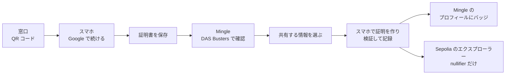

# デモの手順

[English](demo.md) | 日本語

1回の通しで3分ほどです。渋谷区に住む佐藤 健さん（架空の人物）が、マッチングアプリ Mingle に独身であることを証明します。Mingle は証明書そのものを一度も見ません。

## 用意するもの

| | |
|---|---|
| 窓口 | ステージの画面に映す PC か iPad |
| スマホ | DAS Busters と Mingle の両方に使う1台。プライベートブラウズは使わない |
| URL | https://das-busters.vercel.app を両方の端末で開く |
| Google アカウント | どの Google アカウントでも使えます（ログイン用のアプリは公開済み）。 |
| 1台で済ませる場合 | PC だけなら、窓口画面の QR コードの下にある **スマホがない場合は、このパソコンで続ける** を押し、以降の手順をすべてそのブラウザで進めます。スマホだけなら、スマホで窓口を開き、QR コードの下の **このスマホで受け取る** を押します。 |

**言語**：最初は英語で表示されます。`EN / 日本語` の切り替えは、ハブ、窓口、受け取りから共有までの DAS Busters の各画面、Mingle のプロフィールと設定画面にあります。どの URL でも `?lang=ja` を付ければ日本語になります。窓口の QR コードは言語をスマホに引き継ぐので、窓口を日本語にしておけばスマホ側も日本語で始まります。

**本番前の確認**：ハブ（`/`）にモードのバッジが4つ出ます。フルのデモでは `ログイン: Google（Privy）`、`証明: Groth16`、`Sepolia に記録` になっているはずです。`人間確認: World ID staging` と出ていれば正常です。Portal の staging 窓が 2026年9月27日 16:58 JST に閉じると、`人間確認: シミュレーション` に戻ります（手順5を参照）。モックやオフチェーンの表示があれば [モードのバッジ](#モードのバッジ) を見てください。

## 本番の流れ

### 1. 窓口を開く

- **操作**：PC でハブを開き、**発行窓口** を押す。
- **見えるもの**：渋谷区の窓口画面。QR コードと **次のコードまで** のカウントダウンが出ます。コードは3分ごとに新しくなり、表示されてから10分間使えます。
- **話すこと**：「健さんは区役所に来ています。窓口は独身証明書を QR コードで渡します。」

### 2. QR コードを読み取る

- **操作**：スマホのカメラで QR コードを読み取り、リンクを開く。
- **見えるもの**：**証明書を受け取る** の画面。氏名、生年月日、婚姻状況が載っていて、誰が受け取ってもこの見本の証明書が発行されるという注記があります。
- **話すこと**：「コピーを送れば、マッチングアプリにはこれが全部渡ります。Mingle はこのどれも見ません。」

### 3. Google でログイン

- **操作**：**Google で続ける** を押し、テスト用のアカウントを選ぶ。
- **見えるもの**：DAS Busters に戻り、**〜 としてログイン中** と **この端末に保存** が出ます。ログインの部品を読み込むあいだ、ボタンが **鍵を準備しています…** になることがあります。
- **話すこと**：「Privy が健さんに埋め込みウォレットを用意します。そのウォレットの署名から保有者鍵を作ります。」

### 4. 証明書を保存

- **操作**：**証明書を保存** を押す。ウォレットの署名と区役所の署名が終わるまで、ボタンは **保存中…** になります。続けて **ホームへ** を押す。
- **見えるもの**：**証明書を保存しました**、そのあと証明書の入った **マイ証明** の画面。
- **話すこと**：「区役所は、健さんの鍵へのコミットメントと一緒に証明書に署名しています。この証明書で何かを証明できるのは、健さんの鍵を持つ人だけです。」

### 5. 人間確認（任意）

- **操作**：ホームで **World ID で確認** を押し、もう一度 **World ID で確認する** を押す。画面の上に World ID Simulator が開くので **Continue** を押す。Presented と出ると自動で閉じるので、**続ける** を押す。
- **見えるもの**：Simulator のあとに **人間確認が完了しました**。「World ID の staging 環境で確認しました。Simulator のテスト用 ID なので、実在の人の確認ではありません。」と出ます。
- **話すこと**：「IDKit から出した本物の World ID リクエストを、World の Developer Portal が検証しています。staging では World App の代わりに World ID Simulator を使い、画面にもそう書いてあります。Mingle が知るのは、World ID の確認が通ったことだけです。このデモでは、まだ証明書とは結びつけていません。」
- **戻ってしまったとき**：staging 窓は24時間で閉じます。閉じるとハブに `人間確認: シミュレーション` と出て、この手順は **人間確認 · シミュレーション** の画面でカメラを開く流れに変わります（5秒待って **続ける**。**カメラを使わずに完了（シミュレーション）** でも進めます）。開き直すには `npx tsx --env-file=.env.local scripts/world-staging.ts` を実行し、`WORLDID_STAGING_TOKEN` と `WORLDID_STAGING_EXPIRES_AT` を Vercel にコピーして再デプロイします。コマンドは [setup.ja.md](setup.ja.md#world-id-の-staging-窓) にあります。

### 5b. World ID を使わない場合（任意）

人間確認が任意だと見せたいときは、手順5の代わりにこちらをやります。

- **操作**：**World ID で確認**、**World ID で確認する** の順に押す。Simulator が開いたら、**Continue** ではなく右上の **×** を押す。**‹** でホームに戻る。
- **見えるもの**：リクエストの画面に戻り、何も保存されません。ホームには **World ID で確認** が残ったままです。手順7の共有画面にはチェックボックスの代わりに **人間確認を追加** が出て、手順8の Mingle では人間確認のバッジなしで独身証明が出ます。
- **話すこと**：「World ID は任意です。なくても証明書で独身は証明できます。Mingle に人間確認が届かないだけです。」

### 6. Mingle が確認を求める

- **操作**：保存完了画面の **Mingle で独身証明を使う** か、DAS Busters のホームの **Mingle で証明する →** を押す。どちらも Mingle の確認画面を開きます。ハブから入る場合は、Mingle を開いて、健さんの街の下の **DAS Busters で独身を証明する** か、**独身証明は未確認** と出ている **本人確認と証明** を押します。そのあと **DAS Busters で確認**、**続ける** の順に押す。
- **見えるもの**：Mingle の独身証明が **未確認** の状態。そのあと DAS Busters の **共有する情報を選ぶ** の画面に移ります。
- **話すこと**：「Mingle が知りたいのは、健さんが独身かどうか、それだけです。」

### 7. 共有する情報を選ぶ

- **操作**：**独身であること** は必須なのでオンのまま。必要なら **東京在住** と **年代: 30代** もオンにする。手順5をやった場合は **人間確認も含める** にチェックを入れたままにする。
- **見えるもの**：何が渡らないかを書いた一文と、「証明はこのスマホの中で作ります。」の一文。
- **話すこと**：「渡す事実は健さんが選びます。それ以外は証明の中に隠れたままです。」

### 8. 共有する

- **操作**：**選んだ情報を共有** を押す。
- **見えるもの**：**このスマホで証明を作成中…**、続いて **Sepolia に記録中…** と「Sepolia のブロックを待っています。たいてい 10〜20 秒です。この画面は開いたままにしてください。」が出て、そのあと Mingle のプロフィールに **✓ 独身証明済み** と、選んだ項目のバッジが出ます。人間確認を含めた場合は、そのバッジも付きます。
- **スマホで作りきれなかったとき**：ボタンが「このスマホでは作れませんでした。DAS Busters のサーバーで証明を作成中…」に変わり、その1回だけサーバーが証明を作ります（Vercel で1〜4秒ほど）。ステージではそのまま説明してください。
- **話すこと**：「いまのがスマホの中で作ったゼロ知識証明です。Mingle が知ったのは、健さんが独身だということだけです。」

### 9. Mingle が受け取ったもの

- **操作**：Mingle のプロフィールで **Mingle が受け取った情報 ›** を押す。
- **見えるもの**：**Mingle が受け取った情報** として、独身であること（共有したなら東京在住と30代も）、検証の方法（**ゼロ知識証明（Groth16）**、**Sepolia に記録済み（ブロック …）**）、短く表示した Mingle 用の匿名の番号（nullifier）が並びます。その下の **Mingle が受け取っていない情報** には、氏名、生年月日、住所、証明書、Google アカウントが挙がっています。
- **話すこと**：「健さんの証明書について Mingle が持っているのは、これで全部です。」

### 10. Sepolia のエクスプローラーで見る

- **操作**：**Sepolia に記録済み（ブロック …） ↗** を押す。Etherscan でトランザクションが開きます。続けてアドレスバーの `sepolia.etherscan.io` を `eth-sepolia.blockscout.com` に書き換えます（`/tx/…` のパスはそのまま）。
- **見えるもの**：Etherscan での検証がまだなので、Etherscan では呼び出しが `0x93f984ee`、ログが生の topic のまま表示されます。ソースを検証済みの Blockscout では、SingleProofRegistry の `record` の呼び出しと、`nullifierHash`、`scopeHash`、`requestHash` の入った `SingleStatusVerified` イベントが1つ見えます。
- **話すこと**：「チェーンに残るのは nullifier 1つです。氏名も生年月日もありません。」
- **質問されたら**：トランザクションの入力には、証明と公開シグナルが入っています。東京の住所コードと生まれ年の範囲がそこに出るのは、健さんが共有を選んだときだけです。Mingle に出ている番号と見比べるときは、topic を10進数で表示してください。

### 11. 同じ証明書でもう一度（任意）

この手順は `Sepolia に記録` のときだけ意味があります。オフチェーンだと繰り返しを止める仕組みがありません。Mingle のリクエストが有効なうちに、手順6から10分以内にやってください。

- **操作**：スマホでブラウザの戻るボタンを押して **共有する情報を選ぶ** に戻り、もう一度 **選んだ情報を共有** を押す。
- **見えるもの**：エラー「この証明書は、すでに Mingle のアカウントに連携されています。デモをやり直すには、デモをリセットしてください。」と、**Mingle を最初からやり直す** のボタン。
- **話すこと**：「証明書も相手のアプリも同じなので、nullifier も同じになります。レジストリが拒否するので、証明書1枚で作れるアカウントは1つです。」
- **続けるには**：**Mingle を最初からやり直す** を押します。証明書は残したまま Mingle の記録だけを消すので、Mingle は新しい scope で始まり、確認画面が開きます。もう一度 **DAS Busters で確認** から進めば、新しい nullifier で共有できます。

## 通しのあいだのリセット

リセットは1回で、スマホ上の両方のアプリが消えます。対象は証明書、人間確認、共有の履歴、Mingle の確認結果です。Mingle の scope が新しくなるので、同じ証明書でも nullifier が変わり、もう一度確認できます。近い場所から押してください。

- **リセット画面**：`/reset` を開くか、ハブの下の **デモをリセット** から入り、**デモをリセット** を押す。Google のログインは残ります。
- **Mingle**：右上の設定アイコンを押し、**デモをリセット（DAS Busters と Mingle）** を押す。ハブに戻ります。
- **DAS Busters**：ウォレットのホームで右上の丸いアイコンを押し、**デモをリセット（DAS Busters と Mingle）** を押す。こちらは Google からもログアウトします。

## うまくいかないとき

**QR コードの期限切れ**：窓口は3分ごとに新しい QR コードを自動で出します。コードは表示されてから10分間使えるので、読み取ってからログインと保存までには少なくとも7分あります。スマホに **この QR コードは期限切れです** と出たら、いま窓口に出ているコードを読み取ってください。

**Google ログイン**
- 本番の URL を使ってください。`http://192.168.x.x:3000` のような PC の IP アドレスは、Privy の許可リストに入っていません。
- Google から戻って **証明書を受け取る** の画面に **〜 として続ける** のボタンが出ていたら、それを押します。
- **鍵を準備しています…** はログインの部品を読み込むあいだの表示で、時間切れはありません。消えないときはページを再読み込みしてください。
- **保存中…** のあいだに、ウォレットの署名と区役所の署名を行います。署名のほうは30秒で止まり、「鍵の準備に時間がかかりすぎています。接続を確認して、もう一度お試しください。」と出ます。もう一度 **証明書を保存** を押してください。2回続けて失敗したら、デモをリセットして手順1からやり直します。
- Google にアカウントを弾かれたら、チームのアカウントで試したうえで知らせてください。ログインのアプリは公開済みなので、本来は起きないはずです。

**スマホでの証明が遅い**：共有画面は開いた時点で回路のファイル（7.7 MB）のダウンロードを始めます。共有を押す少し前に、会場の Wi-Fi で画面を開いておいてください。スマホで作りきれなければサーバーが作り、ボタンにもそう出ます（手順8）。

**Sepolia が遅い**：**Sepolia に記録中…** は最大45秒ほどかかります。それまでにブロックが来なければ、Mingle は「Sepolia でトランザクションがまだ確定していません。リンク先で状況を確認できます。」と添えて結果を出します。ブロックに入れば、リンクの表示が **Sepolia に記録済み（ブロック …）** に変わります。

**Sepolia に届かない、または relayer のテスト用 ETH が尽きた**：Mingle は証明の検証だけは行い、それがオフチェーンだったことを画面に出します。検証の欄は **Mingle がオフチェーンで検証** になり、理由を書いた注記が付きます。トランザクションのリンクは出ません。ステージではそのまま説明してください。オンチェーンだったかのようには見せません。relayer の残高は [setup.ja.md](setup.ja.md#relayer-のガス代) にあります。

**レジストリが証明を拒否した**：共有画面にエラーとして出ます。成功として見えることはありません。たいていは手順11をうっかりやったのが原因です。**Mingle を最初からやり直す** を押すか、デモをリセットしてください。

### モードのバッジ

連携先ごとに本物と代役があり、どちらを使うかはサーバーが決めます。バッジはいまどちらが動いているかを示します。ハブには4つすべて、共有画面と Mingle の確認画面には証明とチェーンの2つが出ます。

| バッジ | 意味 |
|---|---|
| `ログイン: Google（Privy）` | 本物の Google ログイン |
| `ログイン: モック` | Google を使わず、組み込みのデモ用アカウントでログインする |
| `証明: Groth16` | 回路から作った本物のゼロ知識証明。スマホで作り、サーバーは予備 |
| `証明: モック` | サーバーは同じルールを確認するが、ゼロ知識証明は作らない |
| `Sepolia に記録` | 確認のたびに relayer が SingleProofRegistry に記録する |
| `オフチェーンで検証` | Mingle が自分で証明を確認する。チェーンには何も載らない |
| `人間確認: シミュレーション` | カメラが5秒開くだけ。World ID の証明は作られない |
| `人間確認: World ID staging` | IDKit 4 の World ID リクエストを World ID Simulator で承認し、Developer Portal が検証する |
| `人間確認: World ID` | 同じことを本番の World App で行う（未設定） |
