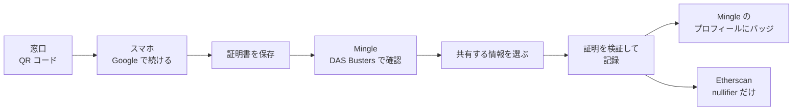

# デモの手順

[English](demo.md) | 日本語

1回の通しで3分ほどです。渋谷区に住む佐藤 健さん（架空の人物）が、マッチングアプリ Mingle に独身であることを証明します。Mingle は証明書そのものを一度も見ません。

## 用意するもの

| | |
|---|---|
| 窓口 | ステージの画面に映す PC か iPad |
| スマホ | DAS Busters と Mingle の両方に使う1台。プライベートブラウズは使わない |
| URL | https://single-proof.vercel.app を両方の端末で開く |
| Google アカウント | どの Google アカウントでも使えます。Google ログインのアプリを公開済みなので、審査員が自分のアカウントで試せます。 |

**言語**: 最初は英語で表示されます。`EN / 日本語` の切り替えは、ハブ、窓口、ウォレットのホーム、Mingle の設定画面にあります。どの URL でも `?lang=ja` を付ければ日本語になります。窓口の QR コードは言語をスマホに引き継ぐので、窓口を日本語にしておけばスマホ側も日本語で始まります。

**本番前の確認**: ハブ（`/`）にモードのバッジが4つ出ます。フルのデモでは `ログイン: Google（Privy）`、`証明: Groth16`、`Sepolia に記録` になっているはずです。`人間確認: シミュレーション` はそのままで問題ありません。モックやオフチェーンの表示があれば [モードのバッジ](#モードのバッジ) を見てください。

## 本番の流れ

### 1. 窓口を開く

- **操作**: PC でハブを開き、**発行窓口** を押す。
- **見えるもの**: 渋谷区の窓口画面。QR コードと3分のカウントダウン。
- **話すこと**: 「健さんは区役所に来ています。窓口は独身証明書を QR コードで渡します。」

### 2. QR コードを読み取る

- **操作**: スマホのカメラで QR コードを読み取り、リンクを開く。
- **見えるもの**: **証明書を受け取る** の画面。氏名、生年月日、婚姻状況がすべて載っています。
- **話すこと**: 「コピーを送れば、マッチングアプリにはこれが全部渡ります。この情報はスマホから出しません。」

### 3. Google でログイン

- **操作**: **Google で続ける** を押し、テスト用のアカウントを選ぶ。
- **見えるもの**: DAS Busters に戻り、**〜 としてログイン中** と **この端末に保存** が出ます。ボタンは少しのあいだ **鍵を準備しています…** になります。
- **話すこと**: 「Privy が健さんに埋め込みウォレットを用意します。そのウォレットの署名から保有者鍵を作ります。」

### 4. 証明書を保存

- **操作**: **証明書を保存** を押し、続けて **ホームへ** を押す。
- **見えるもの**: **証明書を保存しました**、そのあと証明書の入った **マイ証明** の画面。
- **話すこと**: 「区役所は、健さんの鍵へのコミットメントと一緒に証明書に署名しています。この証明書で証明を作れるのは、このスマホだけです。」

### 5. 人間確認（任意）

- **操作**: ホームで **World ID で確認** を押し、**カメラを開く** を押す。5秒たったら **続ける** を押す。
- **見えるもの**: **人間確認が完了しました**。シミュレーションだと明記されています。
- **話すこと**: 「この World ID の確認はデモ用のシミュレーションで、画面にもそう書いてあります。」

### 6. Mingle が確認を求める

- **操作**: ハブから Mingle を開く。**本人確認と証明** を押し、**DAS Busters で確認**、**続ける** の順に押す。
- **見えるもの**: 健さんのプロフィール（36歳、東京）。独身証明は **未確認**。そのあと DAS Busters の **共有する情報を選ぶ** の画面に移ります。
- **話すこと**: 「Mingle が知りたいのは、健さんが独身かどうか、それだけです。」

### 7. 共有する情報を選ぶ

- **操作**: **独身であること** は必須なのでオンのまま。必要なら **東京在住** と **年代: 30代** もオンにする。手順5をやった場合は **人間確認も含める** にチェックを入れたままにする。
- **見えるもの**: 「氏名、生年月日、証明書の原本は渡りません。」の一文。
- **話すこと**: 「渡す事実は健さんが選びます。それ以外は証明の中に隠れたままです。」

### 8. 共有する

- **操作**: **選んだ情報を共有** を押す。
- **見えるもの**: **証明を作成中…**（1〜4秒）、**Sepolia に記録中…** のあと、Mingle のプロフィールに **✓ 独身証明済み** と、選んだ項目のバッジが出ます。
- **話すこと**: 「いまのがゼロ知識証明です。Mingle が知ったのは、健さんが独身だということだけです。」

### 9. Mingle が受け取ったもの

- **操作**: **本人確認と証明** を押す。
- **見えるもの**: 共有した情報、証明 **ゼロ知識証明（Groth16）**、検証 **Sepolia に記録済み（ブロック …）**、短く表示した nullifier、「Mingle は、あなたの氏名、生年月日、住所を受け取っていません。」の一文。
- **話すこと**: 「健さんの証明書について Mingle が持っているのは、これで全部です。」

### 10. Etherscan

- **操作**: **Sepolia に記録済み（ブロック …） ↗** を押す。
- **見えるもの**: SingleProofRegistry の `record` の呼び出し。**Logs** には `SingleStatusVerified` のイベントが1つあり、`nullifierHash`、`scopeHash`、`requestHash` が入っています。
- **話すこと**: 「チェーンに残るのは nullifier 1つです。氏名も生年月日もありません。」
- **質問されたら**: トランザクションの入力には、証明と公開シグナルが入っています。東京の住所コードと生まれ年の範囲がそこに出るのは、健さんが共有を選んだときだけです。Mingle に出ている nullifier と見比べるときは、Etherscan で topic を10進数表示に切り替えてください。

### 11. 同じ証明書でもう一度（任意）

この手順は `Sepolia に記録` のときだけ意味があります。オフチェーンだと繰り返しを止める仕組みがありません。Mingle のリクエストが有効なうちに、手順6から10分以内にやってください。

- **操作**: スマホでブラウザの戻るボタンを押して **共有する情報を選ぶ** に戻り、もう一度 **選んだ情報を共有** を押す。
- **見えるもの**: エラー「この証明書は、すでに Mingle のアカウントに連携されています。デモをやり直すには、デモをリセットしてください。」
- **話すこと**: 「証明書も相手のアプリも同じなので、nullifier も同じになります。レジストリが拒否するので、証明書1枚で作れるアカウントは1つです。」

## 通しのあいだのリセット

リセットは1回で、スマホ上の両方のアプリが消えます。対象は証明書、人間確認、共有の履歴、Mingle の確認結果です。Mingle の scope が新しくなるので、同じ証明書でも nullifier が変わり、もう一度確認できます。近い場所から押してください。

- **リセット画面**: `/reset` を開くか、ハブの下の **デモをリセット** から入り、**デモをリセット** を押す。Google のログインは残ります。
- **Mingle**: 右上の設定アイコンを押し、**デモをリセット（DAS Busters と Mingle）** を押す。ハブに戻ります。
- **DAS Busters**: ウォレットのホームで右上の丸いアイコンを押し、**デモをリセット（DAS Busters と Mingle）** を押す。こちらは Google からもログアウトします。

## うまくいかないとき

**QR コードの期限切れ**: 窓口は3分ごとに新しい QR コードを自動で出します。スマホに **この QR コードは期限切れです** と出たら、新しいほうを読み取ってください。読み取ってから、ログインと保存までの猶予は10分です。

**Google ログイン**
- 本番の URL を使ってください。`http://192.168.x.x:3000` のような PC の IP アドレスは、Privy の許可リストに入っていません。
- Google から戻って **証明書を受け取る** の画面に **〜 として続ける** のボタンが出ていたら、それを押します。
- **鍵を準備しています…** は30秒で止まり、「鍵の準備に時間がかかりすぎています。」と出ます。もう一度 **証明書を保存** を押してください。2回続けて失敗したら、デモをリセットして手順1からやり直します。
- Google にアカウントを弾かれたら、チームのアカウントで試したうえで知らせてください。ログインのアプリは公開済みなので、本来は起きないはずです。

**Sepolia が遅い**: **Sepolia に記録中…** は最大45秒ほどかかります。それまでにブロックが来なければ、Mingle は「Sepolia でトランザクションがまだ確定していません。リンク先で状況を確認できます。」と添えて結果を出します。ブロックに入れば、リンクの表示が **Sepolia に記録済み（ブロック …）** に変わります。

**Sepolia に届かない**: Mingle は証明の検証だけは行い、それがオフチェーンだったことを画面に出します。検証の欄は **Mingle がオフチェーンで検証** になり、「Sepolia に接続できなかったため、Mingle はオフチェーンでのみ証明を検証しました。」と表示されます。Etherscan のリンクは出ません。ステージではそのまま説明してください。オンチェーンだったかのようには見せません。

**レジストリが証明を拒否した**: 共有画面にエラーとして出ます。成功として見えることはありません。たいていは手順11をうっかりやったのが原因なので、デモをリセットしてください。

### モードのバッジ

連携先ごとに本物と代役があり、どちらを使うかはサーバーが決めます。バッジはいまどちらが動いているかを示します。ハブには4つすべて、共有画面と Mingle の確認画面には証明とチェーンの2つが出ます。

| バッジ | 意味 |
|---|---|
| `ログイン: Google（Privy）` | 本物の Google ログイン |
| `ログイン: モック` | Google を使わず、組み込みのデモ用アカウントでログインする |
| `証明: Groth16` | 回路から作った本物のゼロ知識証明 |
| `証明: モック` | サーバーは同じルールを確認するが、ゼロ知識証明は作らない |
| `Sepolia に記録` | 確認のたびに relayer が SingleProofRegistry に記録する |
| `オフチェーンで検証` | Mingle が自分で証明を確認する。チェーンには何も載らない |
| `人間確認: シミュレーション` | カメラが5秒開くだけ。World ID の証明は作られない |
| `人間確認: World ID` | 本物の World ID の確認（未実装） |
