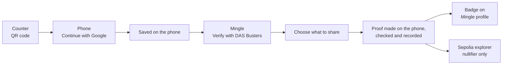

# Demo walkthrough

English | [日本語](demo.ja.md)

One run takes about three minutes. Ken is a fictional resident of Shibuya City. He proves to the dating app Mingle that he is single, and Mingle never sees his certificate.

## What you need

| | |
|---|---|
| Counter | A laptop or iPad on the stage screen |
| Phone | One phone for both DAS Busters and Mingle, not in private browsing |
| URL | https://das-busters.vercel.app, on both devices |
| Google account | Any Google account works; the sign-in app is published. |
| One device instead | A laptop alone: on the counter, click **No phone? Continue on this computer** under the QR code, and run every step in that browser. A phone alone: open the counter on the phone and tap **Receive it on this phone** under the QR code. |

**Language.** Everything starts in English. The `EN / 日本語` toggle is on the hub, the counter, every DAS Busters screen from pickup to sharing, and Mingle's profile and Settings. Adding `?lang=ja` to any URL also switches to Japanese. The counter's QR code carries its language to the phone, so switching the counter is enough.

**Check before going on stage.** The hub (`/`) shows four mode badges. For the full demo they read `Sign-in: Google via Privy`, `Proof: Groth16` and `Recorded on Sepolia`. `Human check: World ID staging` is expected until the Portal's staging window closes on 27 September 2026 at 23:53 JST (see step 5); after that it falls back to `Human check: simulated`. See [Mode badges](#mode-badges) if any of them says mock or off-chain.

## The run

### 1. Open the counter

- **Do**: on the laptop, open the hub and click **Issuing counter**.
- **They see**: the Shibuya City counter with a QR code and a **New code in** countdown. A new code appears every 3 minutes, and each code works for 10 minutes after it appears.
- **Say**: "Ken is at the city office. The counter hands him his Single Status Certificate as a QR code."

### 2. Scan the QR code

- **Do**: scan the QR code with the phone's camera and open the link.
- **They see**: **Receive your certificate**, with Ken's full name, residence, date of birth and marital status, and a note that every pickup issues this sample certificate.
- **Say**: "This is what a dating app would get if Ken sent a copy. Mingle will never see any of it."

### 3. Sign in with Google

- **Do**: tap **Continue with Google** and pick the test account.
- **They see**: Google's account picker, then DAS Busters again. The save starts by itself.
- **Say**: "Privy gives Ken an embedded wallet. A signature from it becomes his holder key."

### 4. The certificate saves itself

- **Do**: nothing until **Certificate saved** appears, then tap **Go to home**.
- **They see**: **Saving your certificate** with three steps ticking off: **Signed in with Google**, **Your key** ("Made and kept on this phone") and **City office signature**. Then **Certificate saved**, and **My proofs** with the certificate and a **Human check** card.
- **Say**: "The city office signed the certificate together with a commitment to Ken's key. Only someone with Ken's key can prove anything with it."

### 5. Human check (optional)

- **Do**: on the home screen, tap **Verify with World ID** in the Human check card. The World ID Simulator opens over the screen; tap **Continue** in it. It closes by itself about 10 seconds later.
- **They see**: the Simulator, **Checking with World ID…**, then the same card turns green: **Human check complete**, "World ID staging · a Simulator identity, not a real person".
- **Say**: "This is a real World ID request through IDKit, checked by World's Developer Portal. On staging the World ID Simulator stands in for World App, and the app says so. Mingle learns only that a World ID check passed. In this demo it is not yet tied to the certificate."
- **If asked about repeats**: World ID shows that a real person approved. Refusing repeats is next: we would bind the World ID signal to Mingle's own nullifier from the ZK proof and store (nullifier, action) under a unique key. On staging every Simulator user is the same test identity, so the demo does not refuse repeats. Our server accepts only a Proof of Human credential.
- **If it falls back**: the staging window lasts 24 hours. When it has closed, the hub shows `Human check: simulated`, and this step opens the camera instead, under **Human check · simulated** (five seconds, then **Continue**, or **Complete without camera (simulated)**). To reopen it, run `npx tsx --env-file=.env.local scripts/world-staging.ts` and copy `WORLDID_STAGING_TOKEN` and `WORLDID_STAGING_EXPIRES_AT` to Vercel, then redeploy. The exact commands are in [setup.md](setup.md#world-id-staging-window).

### 5b. Without World ID (optional)

Use this instead of step 5 to show that the human check is optional.

- **Do**: tap **Verify with World ID**. When the Simulator opens, tap the **×** in the white bar above the Simulator (not a × inside it) instead of **Continue**.
- **They see**: the home screen again with "World ID cancelled. Nothing was shared. You can still share your single status without it." under **Verify with World ID**. Nothing is saved. In step 7 the share screen shows **Add a human check** instead of the tick box, and in step 8 Mingle shows single status without a Human badge.
- **Say**: "World ID is optional. Without it, the certificate still proves single status; Mingle just doesn't get the human check."

### 6. Mingle asks

- **Do**: tap **Verify single status on Mingle** on the Certificate saved screen, or **Prove it on Mingle →** on the DAS Busters home screen. Either one opens Mingle's verification screen. From the hub instead, open Mingle and tap **Verify single status with DAS Busters** under Ken's city, or **Identity & verification**, which reads **Single status: not verified**. Then tap **Verify with DAS Busters**. It shows **Opening DAS Busters…** for a moment.
- **They see**: Mingle's Single status **Not verified**, then DAS Busters with **Choose what to share**.
- **Say**: "Mingle wants to know one thing: is Ken single?"

### 7. Choose what to share

- **Do**: leave **Single status** on; it is required. Turn on **Lives in Tokyo** and **Age range: 30s** if you like. If you did step 5, keep **Include human check** ticked. If you skipped it, **Check now** next to **Add a human check** runs World ID on this screen and ticks the box.
- **They see**: a line saying what will not be shared, and "The proof is made on this phone."
- **Say**: "Ken picks the facts. Everything else stays hidden inside the proof."

### 8. Share

- **Do**: tap **Share selected information**.
- **They see**: two steps under the list. **Zero-knowledge proof** reads "Making it on this phone…", then "Made on this phone in 0.9 s" (the real time). **Mingle checks it and records it on Sepolia** then counts up: "Waiting for a Sepolia block · 8 s". Then Mingle's profile with **✓ Single status verified** and a badge for each fact Ken chose (and a Human badge if he included the check).
- **If the phone cannot finish**: the first step changes to "This phone could not finish. Making it on the DAS Busters server…" and the server makes that one proof (about 1 to 4 seconds on Vercel). Say so on stage.
- **Say**: "That was a zero-knowledge proof, made on the phone. Mingle learned that Ken is single, and nothing else."

### 9. What Mingle received

- **Do**: on Mingle's profile, tap **What Mingle received ›**.
- **They see**: **What Mingle received**: single status, plus Tokyo or 30s if shared, the human check (**None** if not included), a short anonymous number for Mingle (the nullifier), a **Signed by** row reading **City office (its public key)**, and how it was checked (**Zero-knowledge (Groth16)**, **Recorded on Sepolia, block …**). Below it, **What Mingle did not receive**: no name, birth date, address, certificate or Google account.
- **Say**: "This is everything Mingle holds about Ken's certificate."

### 10. On the Sepolia explorer

- **Do**: tap **Recorded on Sepolia, block … ↗**. It opens the transaction on Etherscan. Then change `sepolia.etherscan.io` in the address bar to `eth-sepolia.blockscout.com` (the path `/tx/…` stays the same).
- **They see**: Etherscan shows the call as `0x93f984ee` and the log as raw topics. Blockscout, where the source is verified, shows a `record` call to SingleProofRegistry and one `SingleStatusVerified` event with `nullifierHash`, `scopeHash` and `requestHash`.
- **Say**: "The chain stores one nullifier. No name, no birth date."
- **If asked**: the transaction input carries the proof and its public signals. The Tokyo code and the birth-year range appear there only when Ken chose to share them. To compare the nullifier with Mingle's, show the topic in decimal.

### 11. Same certificate again (optional)

This step needs `Recorded on Sepolia`. Off-chain, nothing stops the repeat. Do it within 10 minutes of step 6, while Mingle's request is still valid.

- **Do**: on the phone, press the browser's Back button to return to **Choose what to share**, then tap **Share selected information** again.
- **They see**: an error: "This certificate is already linked to a Mingle account. Reset the demo to start another run." with a **Start Mingle over** button.
- **Say**: "Same certificate, same app, same nullifier. The registry refuses it, so one certificate backs one account."
- **Then**: tap **Start Mingle over**. It keeps the certificate, clears only Mingle's record so Mingle starts a new scope, and opens Mingle's verification screen. **Verify with DAS Busters** again, and the share works with a new nullifier.

## Reset between runs

One reset clears both apps on the phone: the certificate, the human check, the share history and Mingle's verification. Mingle then starts a new scope, so the same certificate gets a new nullifier and can verify again. Pick whichever is closest:

- **Reset page**: open `/reset` (or **Reset demo** at the bottom of the hub) and tap **Reset demo**. Google stays signed in.
- **Mingle**: tap the settings icon at the top right, then **Reset demo (DAS Busters and Mingle)**. You land on the hub.
- **DAS Busters**: on the wallet home, tap the round avatar at the top right, then **Reset demo (DAS Busters and Mingle)**. This one also signs out of Google.

## If something goes wrong

**QR code expired.** The counter shows a new QR code every 3 minutes by itself. A code works for 10 minutes after the counter shows it, so after a scan Ken has at least 7 minutes to sign in and save. If the phone says **This QR code has expired**, scan the counter's current code.

**Google sign-in.**
- Use the live URL. A laptop IP address such as `http://192.168.x.x:3000` is not an allowed origin in Privy.
- Back from Google on **Receive your certificate** with a **Save certificate** button and "Signed in with Google as …" under it: tap it.
- **Your key** spins while the sign-in library loads, with no time limit. If it does not stop, reload the page; the save starts again by itself.
- Once the wallet is ready, **Your key** gives up after 30 seconds with "Setting up your key took too long. Check your connection and try again." Tap **Try again**. If it fails twice, reset the demo and start from step 1.
- If Google refuses an account, try the team's account and tell us: the sign-in app is published, so this should not happen.

**The Simulator shows its card list.** Its own Cancel (next to **Continue**) or the × at the top of its sheet was tapped, and it will not answer this request. Tap the **×** in the white bar above the Simulator; the card then says "World ID cancelled. Nothing was shared. You can still share your single status without it." Tap **Verify with World ID** again. Left alone, the request gives up after 4 minutes with "World ID did not finish (timeout). Try again."

**The proof is slow on the phone.** The share screen starts downloading the circuit files (7.7 MB) as soon as it opens, so open it on stage Wi-Fi a moment before tapping Share. If the phone cannot finish, the server makes the proof and the first step says so (step 8).

**Sepolia is slow.** The **Waiting for a Sepolia block** count can reach about 45 seconds. If the block has not arrived by then, Mingle shows its result with the note "Sepolia has not confirmed the transaction yet. The link shows its status." The link text changes to **Recorded on Sepolia, block …** once the block lands.

**Sepolia is unreachable, or the relayer is out of test ETH.** Mingle still checks the proof, and says it did so off-chain: Checked shows **Off-chain by Mingle**, with a note saying why. There is no transaction link. Say this on stage; don't present it as on-chain. The relayer's balance is in [setup.md](setup.md#relayer-gas).

**The registry refuses the proof.** That shows as an error on the share screen, never as a success. The usual cause is step 11 done by accident: tap **Start Mingle over**, or reset the demo.

### Mode badges

Each integration has a real mode and a stand-in, chosen by the server. The badges say which one is running. The hub shows all four. The share screen and Mingle's verification screen show Proof and the chain badge.

| Badge | Meaning |
|---|---|
| `Sign-in: Google via Privy` | Real Google sign-in |
| `Sign-in: mock` | No Google. A built-in demo account signs in. |
| `Proof: Groth16` | A real zero-knowledge proof from the circuit, made on the phone (the server only as a fallback) |
| `Proof: mock` | The server checks the same rules but makes no zero-knowledge proof |
| `Recorded on Sepolia` | The relayer records each verification in SingleProofRegistry |
| `Verified off-chain` | Mingle checks the proof itself; nothing goes on-chain |
| `Human check: simulated` | The camera opens for five seconds. No World ID proof is made. |
| `Human check: World ID staging` | A World ID request through IDKit 4, approved in the World ID Simulator and verified by the Developer Portal |
| `Human check: World ID` | The same with World App on production (not set up) |
