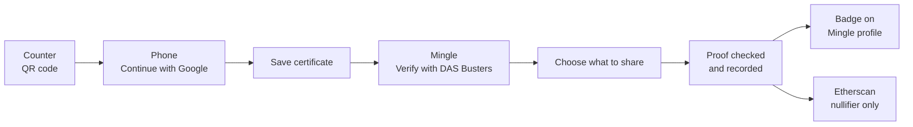

# Demo walkthrough

English | [日本語](demo.ja.md)

One run takes about three minutes. Ken is a fictional resident of Shibuya City. He proves to the dating app Mingle that he is single, and Mingle never sees his certificate.

## What you need

| | |
|---|---|
| Counter | A laptop or iPad on the stage screen |
| Phone | One phone for both DAS Busters and Mingle, not in private browsing |
| URL | https://single-proof.vercel.app, on both devices |
| Google account | Any Google account. The sign-in app is published, so judges can use their own. |

**Language.** Everything starts in English. The `EN / 日本語` toggle is on the hub, the counter, the wallet home and Mingle's Settings. Adding `?lang=ja` to any URL also switches to Japanese. The counter's QR code carries its language to the phone, so switching the counter is enough.

**Check before going on stage.** The hub (`/`) shows four mode badges. For the full demo they read `Sign-in: Google via Privy`, `Proof: Groth16` and `Recorded on Sepolia`. `Human check: simulated` is expected. See [Mode badges](#mode-badges) if any of them says mock or off-chain.

## The run

### 1. Open the counter

- **Do**: on the laptop, open the hub and click **Issuing counter**.
- **They see**: the Shibuya City counter with a QR code and a 3-minute countdown.
- **Say**: "Ken is at the city office. The counter hands him his Single Status Certificate as a QR code."

### 2. Scan the QR code

- **Do**: scan the QR code with the phone's camera and open the link.
- **They see**: **Receive your certificate**, with Ken's full name, date of birth and marital status.
- **Say**: "This is what a dating app would get if Ken sent a copy. None of it will leave the phone."

### 3. Sign in with Google

- **Do**: tap **Continue with Google** and pick the test account.
- **They see**: back in DAS Busters: **Signed in as …** and **Save to this device**. The button shows **Preparing your key…** for a moment.
- **Say**: "Privy gives Ken an embedded wallet. A signature from it becomes his holder key."

### 4. Save the certificate

- **Do**: tap **Save certificate**, then **Go to home**.
- **They see**: **Certificate saved**, then **My proofs** with the certificate.
- **Say**: "The city office signed the certificate together with a commitment to Ken's key. Only this phone can prove anything with it."

### 5. Human check (optional)

- **Do**: on the home screen, tap **Verify with World ID**, then **Open camera**. After five seconds, tap **Continue**.
- **They see**: **Human check complete**, labelled as simulated.
- **Say**: "This World ID check is simulated for the demo, and the app says so."

### 6. Mingle asks

- **Do**: open Mingle from the hub. Tap **Identity & verification**, then **Verify with DAS Busters**, then **Continue**.
- **They see**: Ken's profile (36, Tokyo), Single status **Not verified**, then DAS Busters with **Choose what to share**.
- **Say**: "Mingle wants to know one thing: is Ken single?"

### 7. Choose what to share

- **Do**: leave **Single status** on; it is required. Turn on **Lives in Tokyo** and **Age range: 30s** if you like. If you did step 5, keep **Include human check** ticked.
- **They see**: "Your name, date of birth, and original certificate won’t be shared."
- **Say**: "Ken picks the facts. Everything else stays hidden inside the proof."

### 8. Share

- **Do**: tap **Share selected information**.
- **They see**: **Creating proof…** (1 to 4 seconds), then **Recording on Sepolia…**, then Mingle's profile with **✓ Single status verified** and a badge for each fact Ken chose.
- **Say**: "That was a zero-knowledge proof. Mingle learned that Ken is single, and nothing else."

### 9. What Mingle received

- **Do**: tap **Identity & verification**.
- **They see**: Shared, Proof **Zero-knowledge (Groth16)**, Checked **Recorded on Sepolia, block …**, a short nullifier, and "Mingle never received your name, birth date or address."
- **Say**: "This is everything Mingle holds about Ken's certificate."

### 10. Etherscan

- **Do**: tap **Recorded on Sepolia, block … ↗**.
- **They see**: a `record` call to SingleProofRegistry. In **Logs**, one `SingleStatusVerified` event with `nullifierHash`, `scopeHash` and `requestHash`.
- **Say**: "The chain stores one nullifier. No name, no birth date."
- **If asked**: the transaction input carries the proof and its public signals. The Tokyo code and the birth-year range appear there only when Ken chose to share them. To compare the nullifier with Mingle's, switch the topic on Etherscan to decimal.

### 11. Same certificate again (optional)

This step needs `Recorded on Sepolia`. Off-chain, nothing stops the repeat. Do it within 10 minutes of step 6, while Mingle's request is still valid.

- **Do**: on the phone, press the browser's Back button to return to **Choose what to share**, then tap **Share selected information** again.
- **They see**: an error: "This certificate is already linked to a Mingle account. Reset the demo to start another run."
- **Say**: "Same certificate, same app, same nullifier. The registry refuses it, so one certificate backs one account."

## Reset between runs

One reset clears both apps on the phone: the certificate, the human check, the share history and Mingle's verification. Mingle then starts a new scope, so the same certificate gets a new nullifier and can verify again. Pick whichever is closest:

- **Reset page**: open `/reset` (or **Reset demo** at the bottom of the hub) and tap **Reset demo**. Google stays signed in.
- **Mingle**: tap the settings icon at the top right, then **Reset demo (DAS Busters and Mingle)**. You land on the hub.
- **DAS Busters**: on the wallet home, tap the round avatar at the top right, then **Reset demo (DAS Busters and Mingle)**. This one also signs out of Google.

## If something goes wrong

**QR code expired.** The counter makes a new QR code every 3 minutes by itself. If the phone says **This QR code has expired**, scan the new one. After a scan, Ken has 10 minutes to sign in and save.

**Google sign-in.**
- Use the live URL. A laptop IP address such as `http://192.168.x.x:3000` is not an allowed origin in Privy.
- Back from Google on **Receive your certificate** with a **Continue as …** button: tap it.
- **Preparing your key…** gives up after 30 seconds with "Setting up your key took too long." Tap **Save certificate** again. If it fails twice, reset the demo and start from step 1.
- If Google refuses an account, try the team's account and tell us: the sign-in app is published, so this should not happen.

**Sepolia is slow.** **Recording on Sepolia…** can take up to about 45 seconds. If the block has not arrived by then, Mingle shows its result with the note "Sepolia has not confirmed the transaction yet. The link shows its status." The link text changes to **Recorded on Sepolia, block …** once the block lands.

**Sepolia is unreachable.** Mingle still checks the proof, and says it did so off-chain: Checked shows **Off-chain by Mingle**, with the note "Sepolia could not be reached, so Mingle checked the proof off-chain only." There is no Etherscan link. Say this on stage; don't present it as on-chain.

**The registry refuses the proof.** That shows as an error on the share screen, never as a success. The usual cause is step 11 done by accident: reset the demo.

### Mode badges

Each integration has a real mode and a stand-in, chosen by the server. The badges say which one is running. The hub shows all four. The share screen and Mingle's verification screen show Proof and the chain badge.

| Badge | Meaning |
|---|---|
| `Sign-in: Google via Privy` | Real Google sign-in |
| `Sign-in: mock` | No Google. A built-in demo account signs in. |
| `Proof: Groth16` | A real zero-knowledge proof from the circuit |
| `Proof: mock` | The server checks the same rules but makes no zero-knowledge proof |
| `Recorded on Sepolia` | The relayer records each verification in SingleProofRegistry |
| `Verified off-chain` | Mingle checks the proof itself; nothing goes on-chain |
| `Human check: simulated` | The camera opens for five seconds. No World ID proof is made. |
| `Human check: World ID` | A real World ID check (not built yet) |
