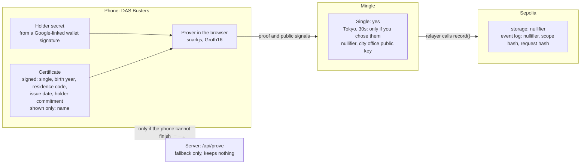
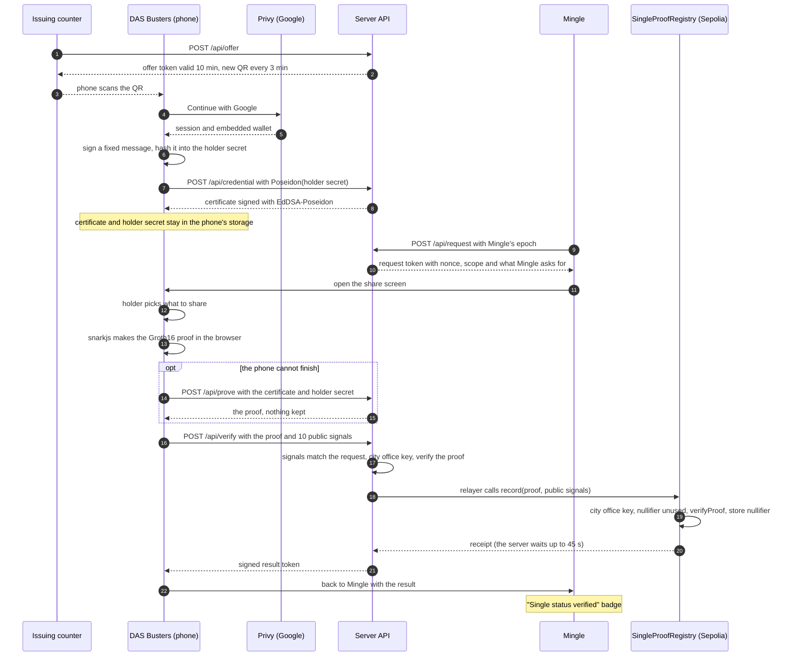
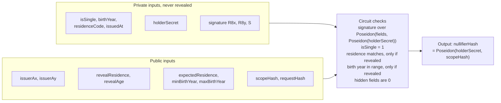
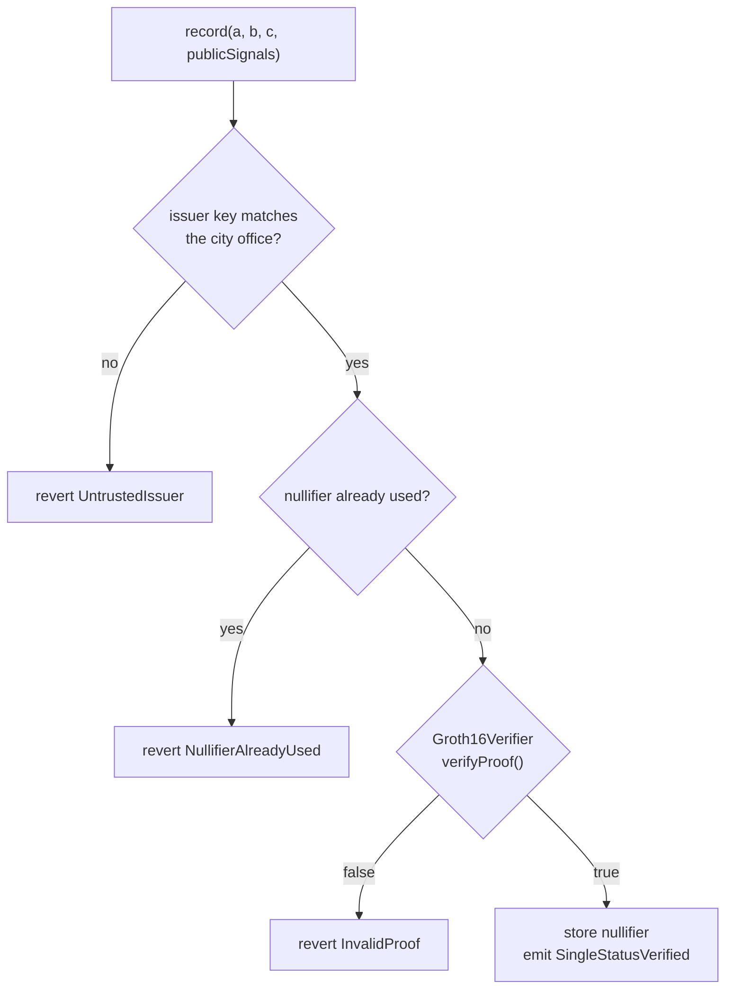
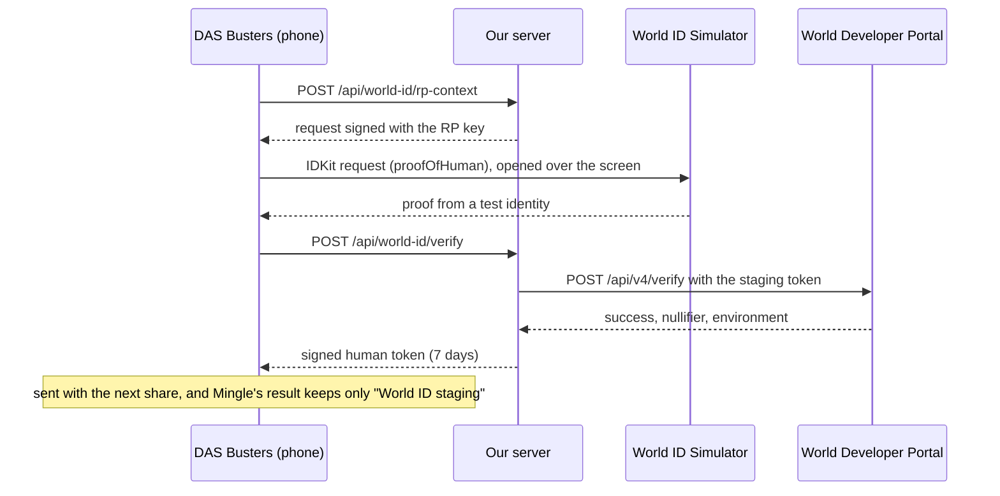

# Technical details

English | [日本語](technical.ja.md)

The detail behind the [README](../README.md): why the design looks the way it does, where each piece of data goes, the circuit, the registry, the security model, the tests and how to run it locally. Contract addresses are in the README under [Contracts on Sepolia](../README.md#contracts-on-sepolia).

## The three screens

- Issuing counter (laptop or iPad). The city office screen shows a QR code. Scanning it gives your phone a Single Status Certificate signed by the city office.
- DAS Busters (phone). A wallet that keeps the certificate. When an app asks, you choose what to prove: that you are single (required), that you live in Tokyo (optional), and that you are in your 30s, meaning born 1987–1996 (optional). The birth year itself stays hidden.
- Mingle (phone). A sample dating app. The member already typed a city and an age on the profile, and Mingle asks the wallet to back them up ([lib/mingle.ts](../lib/mingle.ts)). It checks the proof, shows **✓ Single status verified** on the profile, and its relayer records the nullifier on Ethereum Sepolia.

## Why zero-knowledge

- A copy of the certificate hands over your name, birth date and 本籍 to show one fact.
- A "yes, single" signed by the city office for each app would tell the city office which apps you use, and the signed statements could link you across apps.
- A signed credential with selective disclosure (such as SD-JWT) hides the other fields, but every app sees the same issuer signature, which links you, and it cannot show "born 1987–1996" without showing the date.

The proof shows the fact and keeps the signature and the values hidden, and each app gets its own nullifier.

## Why a blockchain

Mingle's server checks each proof first, for a fast answer and a clear error. The registry contract then checks it again in public and refuses a nullifier it has already recorded. So "one account per certificate per app" is something anyone can check, and Mingle cannot delete a record afterwards. The limit is that the app chooses its scope: the registry does not check which scope a proof was made for, so an app that changes its scope gets new nullifiers. In the demo, each browser that opens Mingle picks its own random epoch, and Reset picks a new one.

## Compared with the My Number Card check

Since April 2025 the dating app Tapple offers かんたん独身証明. It reads the name, address and gender on your My Number Card to match your account, then gets your marital status from the family register through Mynaportal ([Digital Agency](https://digital-agency-news.digital.go.jp/articles/2025-10-17), [Tapple release](https://www.cyberagent.co.jp/news/detail/id=31851)). Every app that works this way ends up holding your verified identity next to your marital status.

DAS Busters gives the app one checked fact and a number that differs per app. The issuer does not have to be a city office counter: Mynaportal could sign the certificate instead of our demo city office, and the proof side would stay the same.

## Where the data lives

| Where | What it holds |
|---|---|
| Phone | The certificate and the holder secret. The phone makes the proof. |
| `/api/prove` | Only if the phone cannot finish (an old browser, too little memory): the certificate and holder secret for that one proof. The share screen says so, and nothing is kept. |
| Mingle | Single: yes, anything you chose to share, the nullifier, and the city office's public key (which shows which office signed) |
| Sepolia storage | The nullifier |
| Sepolia event log | The nullifier, the scope hash and the request hash |
| Sepolia transaction input | The proof and its 10 public signals: the city office's public key, plus the Tokyo code (13) and the birth-year range only if shared |

No name, birth date or address goes on-chain.



## How it fits together

One Next.js app on Vercel serves all three screens. Its API routes play the city office, the fallback prover and Mingle's backend. That is a demo shortcut, described in the next section.



## Demo setup vs a real deployment

The demo server holds the issuer's EdDSA signing key in `ISSUER_PRIVATE_KEY`. The city office, the fallback prover and Mingle's backend all sign their tokens with one `TOKEN_SECRET`, so the whole flow runs from one URL. Real parties would not share a secret like this, and a city office's signing key would never sit on an app server.

| Part | This demo | A real deployment (intended design, not built) |
|---|---|---|
| City office (issuer) | An API route on the demo server; the signing key is a Vercel environment variable | Run by the municipality, or through the national family-register system or Mynaportal. The signing key stays in the office's own hardware security module, and its public key is published in a list of trusted issuers. |
| Wallet (DAS Busters) | Web pages on the same site as Mingle; the certificate and holder secret sit in the browser's localStorage | Its own app or origin, with keys in the phone's secure storage |
| Prover | On the phone by default; the demo server makes the proof only if the phone cannot | On the phone only |
| Mingle's verifier | An API route on the same server, sharing one token secret with the other roles | Mingle's own backend with its own keys, and one fixed scope per app so the nullifier never changes |
| Recording | Sepolia testnet; the demo server's relayer pays the fee | A public mainnet or L2. Mingle (or the wallet) sends the transaction, and the contract checks the proof against the trusted-issuer list by proving membership in a set, for example a Merkle root of city keys, so the proof does not reveal which city. |
| Human check | World ID staging with the Simulator | World ID in production (World App), bound to this proof, with its nullifier checked for repeats |
| Freshness and revocation | Not checked | Mingle asks for an "issued on or after" date as a public input, and the issuer publishes revocations |

## How the proof works

The circuit is [circuits/single_proof.circom](../circuits/single_proof.circom), with 9,921 constraints. It checks:

- the city office's EdDSA-Poseidon signature over the certificate values and the holder's commitment, Poseidon(holder secret);
- single status;
- optionally, residence and a birth-year range.

It outputs a nullifier per holder and verifier scope.

The proof is made in the browser, with snarkjs and the same circuit files the server uses ([lib/deviceProver.ts](../lib/deviceProver.ts); `single_proof.wasm` 2.7 MB and `single_proof.zkey` 5.0 MB). The wallet home starts downloading them once the human check is done, and the share screen does if the home did not. On a laptop in Chrome the proof itself took under a second once the files were cached; we have not measured phones yet. If the phone cannot finish, `/api/prove` makes that one proof and the share screen says "This phone could not finish. Making it on the DAS Busters server…". If the input breaks a rule (not single, someone else's certificate, an edited certificate), the phone shows that error and does not retry on the server. `PROVE_ON=server` moves proving back to the server; the mock prover always runs there.

Trusted setup: the Hermez ptau mirrors returned 403 at the event, so both phases have one local contribution ([circuits/build.sh](../circuits/build.sh)). That is fine for a demo and not for production. PSE Perpetual Powers of Tau is reachable, and moving to it is the next step.



The public signals come out as `nullifierHash` followed by the nine public inputs in the order above. [lib/presentation.ts](../lib/presentation.ts) and the registry both rely on that order. The same holder gets the same nullifier in the same Mingle scope, which is how the registry refuses a second account on one certificate. `requestHash` ties each proof to one Mingle request, so it cannot be reused for a different request. Requests are not marked used; see [Security model and limits](#security-model-and-limits).

## The registry

After Mingle checks a proof, its relayer calls `record` on [SingleProofRegistry](../contracts/src/SingleProofRegistry.sol). The registry checks the city office key, checks that the nullifier is unused, verifies the proof, and stores only the nullifier. It emits the nullifier, the scope hash and the request hash.



A second record with the same nullifier reverts, so one certificate backs one account per scope. In the demo, Mingle's browser keeps the epoch that sets the scope, so Reset starts a new one; a real Mingle would fix its scope.

A revert shows up in Mingle as a failure. Mingle falls back to an off-chain check only when recording fails for another reason, such as Sepolia being unreachable or the relayer running out of test ETH, and it says so on screen.

Both contracts match the source in [contracts/src/](../contracts/src/) exactly on Sourcify. Blockscout shows the source of both contracts and decodes the registry's `record` calls and `SingleStatusVerified` events. Etherscan shows the same data as raw hex, so use Blockscout for a readable view. To check a nullifier yourself, pass the event's first indexed topic, in hex or decimal, to `used(uint256)`; the README has a [`cast call` example](../README.md#contracts-on-sepolia).

## World ID

The certificate proves civil status. It cannot tell whether one person is behind several Google accounts: each account gets its own holder secret and so its own nullifier, and in this demo the counter hands a certificate to anyone who scans. World ID is there to add "a real person approved this".

How the integration went, what slowed us down and what would help: [FEEDBACK.md](../FEEDBACK.md).

### Why proof of human

We request IDKit's `proofOfHuman` preset ([app/wallet/world-id/IdkitRequest.tsx](../app/wallet/world-id/IdkitRequest.tsx)). The browser picks the preset, so the server checks the credential too and refuses any other ([lib/worldid.ts](../lib/worldid.ts)). The certificate already covers civil status, residence and age, so World ID only has to add personhood. Proof of human shares nothing else: no name, face or ID number. We wanted its Orb-backed uniqueness for one person per account. World rates the selfie check as medium assurance: it checks liveness and facial similarity with the device camera and returns a sybil score the app has to interpret ([World docs](https://docs.world.org/world-id/idkit/credentials)). A passport or document credential would repeat what the certificate proves and ask the user for more.

### What Mingle receives

After the World ID check, our server signs a human token. The wallet sends it to Mingle when you include the human check in a share. Mingle's server can read the World ID nullifier for this app from the token, but the result it keeps says only that a human check passed and which kind: World ID, World ID staging or simulated ([app/api/verify/route.ts](../app/api/verify/route.ts)). In this demo the same server signs the token and plays Mingle's backend.

### Without World ID

The check is optional. Cancel the Simulator, or skip the check, and sharing works the same way; Mingle shows single status without the Human badge. [docs/demo.md](demo.md#5b-without-world-id-optional) shows this path.

### Staging and production

This deployment runs World ID staging: our server signs each request (`/api/world-id/rp-context`) and forwards each result to the Developer Portal (`/api/world-id/verify`), and a test identity in the World ID Simulator approves it. Production would use World App and a real person. The code switches with `WORLDID_ENVIRONMENT`, but production is not set up. The screens say which one ran.

### The staging window

The Portal accepts Simulator proofs only while a 24-hour staging window is open. The current window closes on **27 September 2026 at 23:53 JST**. After that the server labels the check simulated, the hub reads `Human check: simulated`, and the human check becomes a five-second camera stand-in. Opening a new window is described in [docs/setup.md](setup.md#world-id-staging-window).

### Current limits

The World ID proof is not bound to the certificate or to the zero-knowledge proof (the request carries no signal), and the World ID nullifier is not checked for repeats. Today it shows that a person approved this World ID request, not that one person holds one account.



## Security model and limits

What each check relies on, and what is not enforced yet:

| Rule | Enforced by |
|---|---|
| The city office signed these values together with this holder's commitment | Circuit (EdDSA-Poseidon) |
| The signing key is the city office's key | Mingle's verifier and the registry (`UntrustedIssuer`); the circuit takes the key as a public input |
| The certificate says single | Circuit (`isSingle === 1`) |
| The person proving holds the holder secret | Circuit (the commitment is inside the signed message) |
| A shared residence or birth-year range matches what Mingle asked for | Circuit, and Mingle's verifier compares the values with its request |
| Hidden values are 0, and disclosure flags are 0 or 1 | Circuit and Mingle's verifier |
| The proof answers this Mingle request | Mingle's verifier (scope hash and request hash). The registry only verifies the proof; it does not check the scope. |
| Every public signal is below the field modulus | snarkjs `verify` and the generated Solidity verifier |
| A nullifier is recorded once | Registry |
| A request is answered only once | Not yet. Requests are stateless, so within their 10 minutes the same proof verifies again off-chain; on-chain the nullifier is still recorded once. |
| The certificate is recent | Not yet. Real verifiers such as IBJ and youbride accept only certificates issued in the last 3 months. The issue date is already signed into the certificate, so Mingle could send an "issued on or after" date as a public input. That needs a new circuit key and a contract redeploy, so it is the next step and not part of this demo. |
| Revocation | Not yet. The issuer would publish revocations. |
| One fixed scope per app | Not yet. In the demo the epoch comes from Mingle's browser, and Reset gives a new epoch and so a new nullifier. |
| World ID is tied to this proof and deduplicated | Not yet. The World ID proof is not bound to the certificate or the proof, and its nullifier is not checked for repeats. |
| Only Mingle's relayer records | Not enforced. `record()` is open to anyone, since the proof is the authorisation. A copied pending call could land first; our relayer's transaction then reverts and Mingle shows an error. |

Demo shortcuts that a real deployment would not have:

- One `TOKEN_SECRET` signs every token for every role: offers, requests, results and human checks ([lib/token.ts](../lib/token.ts)).
- The wallet and Mingle share one origin, so they share one browser storage and keep to separate key prefixes ([lib/storage.ts](../lib/storage.ts)).
- The counter hands Ken's certificate to anyone who scans. A real city office would check ID first.
- When the server fallback prover is used, it sees the certificate and the holder secret for that one request. The mock prover mode always proves on the server.
- The trusted setup has one local contribution per phase (see [How the proof works](#how-the-proof-works)).
- The issuer key is a public signal. With one city office that reveals nothing new; once many offices issue certificates, it would reveal which city issued yours. Proving membership in a set of trusted keys would hide it.
- The circuit range-checks the birth year to 16 bits but not the range bounds; Mingle's verifier requires the bounds to equal the ones it asked for.

## Design decisions

The build plan we wrote before building is in [docs/plan.md](plan.md) (Japanese).

| Decision | Why | Cost |
|---|---|---|
| Prove on the phone, with `/api/prove` as a fallback the share screen names ([lib/deviceProver.ts](../lib/deviceProver.ts), [app/wallet/share/ShareScreen.tsx](../app/wallet/share/ShareScreen.tsx), `PROVE_ON` in [lib/modes.ts](../lib/modes.ts)) | The plan proved on the server, following a mentor's advice and the pre-event prototype. On 26 September we moved proving into the browser so the certificate and holder secret stay on the phone. | A 7.7 MB download, and phone speed not measured yet |
| `nullifier = Poseidon(holderSecret, scopeHash)` ([lib/fields.ts](../lib/fields.ts), [circuits/single_proof.circom](../circuits/single_proof.circom)) | The city office only sees `Poseidon(holderSecret)`, so it cannot compute your nullifier and find you on Mingle. In this demo the fallback prover runs on the same server, so this holds only when the phone proves. | The secret is needed at every proof |
| Uniqueness on `used[nullifierHash]` ([contracts/src/SingleProofRegistry.sol](../contracts/src/SingleProofRegistry.sol)) | Groth16 proofs are malleable, so a proof hash is not unique | Only as stable as the scope |
| Hidden values forced to 0, in the circuit and in Mingle's verifier ([lib/verifier.ts](../lib/verifier.ts)) | A hidden field cannot carry a value that reads as shared | The flags are public, so the transaction shows which facts were shared |
| The server picks every mode from env ([lib/modes.ts](../lib/modes.ts), `verifyProof` in [lib/prover.ts](../lib/prover.ts)) | Mingle's verifier accepts only the prover the server runs, so a client cannot downgrade to the mock | A missing env var means mock, so the hub, the share screen and Mingle show mode badges |
| A revert is a failure ([lib/chain.ts](../lib/chain.ts)) | The relayer simulates `record()` first, and a revert (nullifier used, untrusted issuer, invalid proof) reaches the user as an error. Only RPC or relayer trouble falls back to an off-chain check, labelled on screen. | One simulation call before each transaction |
| Wait up to 45 s for the receipt ([lib/chain.ts](../lib/chain.ts)) | The plan returned the transaction hash at once. Waiting means a result never says "recorded" for a transaction that later reverts. | One Sepolia block longer per share |
| A relayer pays gas ([docs/setup.md](setup.md#relayer-gas)) | Users need no ETH and send no transaction | One funded demo key pays for everyone |
| Holder secret = SHA-256 of a Privy embedded-wallet signature over a fixed message, cut to 31 bytes ([lib/privy.ts](../lib/privy.ts), [app/wallet/_components/holderKey.ts](../app/wallet/_components/holderKey.ts)) | No seed phrase to write down, and 31 bytes stay below the BN254 field. The stored value wins in case signatures are not deterministic. | Depends on Privy and the Google account |
| Stateless HS256 tokens for offers, requests, results and human checks ([lib/token.ts](../lib/token.ts)) | No database on Vercel | A request is not marked used |

Holes in the pre-event prototype ([docs/plan.md](plan.md), section "プロトタイプの穴を繰り返さない"):

| Prototype | Now |
|---|---|
| The client could send `bypass:true` to skip the human check | The server picks the mode from env |
| Reverts were rounded into "off-chain success" | A revert is an error; only RPC or relayer trouble falls back, labelled |
| The issuer seed was committed | Only the public key is in the repository ([lib/zk/issuer-public.json](../lib/zk/issuer-public.json)) |
| Results were not tied to a request | A nonce ties them |
| The 256-bit holder secret overflowed the field | 31 bytes, below the BN254 field |
| The UI said data stayed on the device while the server proved | The phone proves, and the share screen names the server fallback |

## Tests

```sh
npm test                                              # unit tests and circuit tests
npm run test:circuit                                  # the circuit alone: refusals at witness level, then one full prove and verify
git submodule update --init && npm run test:contracts # Foundry, against a real proof
BASE_URL=https://das-busters.vercel.app npm run smoke # the API end to end, including refusals
```

Of the 23 circuit tests, 13 show the circuit itself refusing an input, and each of those checks which constraint failed ([scripts/circuit-test.ts](../scripts/circuit-test.ts)). There are also 24 unit tests ([scripts/unit-test.ts](../scripts/unit-test.ts)), 13 Foundry tests ([contracts/test/SingleProofRegistry.t.sol](../contracts/test/SingleProofRegistry.t.sol)) that run against the real generated verifier and a real proof, and an end-to-end smoke test ([scripts/smoke.ts](../scripts/smoke.ts)). Smoke against a deployment with `CHAIN_MODE=sepolia` sends one Sepolia transaction. The repeat it tries next is refused in simulation and never sent.

| Attack | Refused by | Test |
|---|---|---|
| A certificate the city office signed as not single | Circuit (`isSingle === 1`) | circuit-test.ts |
| An edited birth year or residence | Circuit (signature check) | circuit-test.ts; smoke "an edited certificate cannot prove" (refused by the server prover's signature pre-check) |
| Someone else's certificate (wrong holder secret) | Circuit (signature over the holder commitment) | circuit-test.ts; smoke "someone else's secret cannot prove" (refused by the prover's pre-check) |
| An issuer key that did not sign the certificate | Circuit | circuit-test.ts |
| A birth year outside the revealed range, or a revealed residence that differs | Circuit | circuit-test.ts |
| A value in a hidden field, or a disclosure flag of 2 | Circuit and Mingle's verifier | circuit-test.ts; unit-test.ts |
| A public signal changed after proving | Groth16 verification, off-chain and on-chain | circuit-test.ts; `test_RevertWhen_DisclosedValueIsChanged`; smoke "tampered signals are rejected" (refused by Mingle's request check) |
| A proof relabelled as a mock proof | Mingle's verifier | circuit-test.ts |
| A proof point changed or negated | Solidity verifier (`InvalidProof`) | `test_RevertWhen_ProofPointIsChanged`, `test_RevertWhen_ProofPointIsNegated` |
| A public signal pushed out of the field (the same value plus the modulus), for example to get a second nullifier for one certificate | Solidity verifier (`checkField`, so `InvalidProof`); the issuer key fails earlier as `UntrustedIssuer` | `test_RevertWhen_NullifierIsPushedOutOfTheField`, `test_RevertWhen_AnySignalIsPushedOutOfTheField` |
| A proof reused for another request or scope | Mingle's verifier (`wrong-request`); the registry through `verifyProof` | smoke "a proof cannot be replayed on another request"; `testFuzz_RevertWhen_RequestHashDiffers`, `testFuzz_RevertWhen_ScopeDiffers` (1,000 fuzz runs each) |
| A second account with the same certificate in the same scope | Registry (`NullifierAlreadyUsed`) | `test_RevertWhen_NullifierIsReused`; smoke "one certificate backs one account per epoch" (Sepolia mode only) |
| A failed attempt that uses up the nullifier | Registry (stores only after `verifyProof`) | `test_FailedAttemptDoesNotBurnTheNullifier` |
| A certificate from an untrusted issuer | Mingle's verifier and the registry (`UntrustedIssuer`) | circuit-test.ts; `test_RevertWhen_IssuerIsNotTrusted` |
| A World ID claim without the server's token | `/api/verify` | smoke "a World ID claim without the server's token is refused" |
| A fake pickup QR code | `/api/credential` | smoke "a fake QR code is rejected" |

## Language

The UI defaults to English. The hub, the counter, the DAS Busters screens from pickup to sharing, Mingle's profile and settings, and the explainer, reset and privacy pages each have an EN / 日本語 toggle. The choice applies to every app in that browser. Adding `?lang=ja` to any URL does the same, and the counter's QR code carries its language to the phone.

## Running locally

Needs Node 22 or later. `npm install`, then `npm run dev`, and open http://localhost:3000. With no `.env.local`, every integration falls back to its mock, and the hub badges say so: `Sign-in: mock`, `Proof: mock`, `Verified off-chain`, `Human check: simulated`. The key names are in [.env.example](../.env.example).

- For real proofs, set `TOKEN_SECRET` and `ISSUER_PRIVATE_KEY` (each `openssl rand -hex 32`) and `PROVER_MODE=groth16`, then run `ISSUER_PRIVATE_KEY=... npx tsx scripts/issuer-key.ts`. That rewrites [lib/zk/issuer-public.json](../lib/zk/issuer-public.json) to your key, which then no longer matches the deployed registry or the Foundry fixture. Keep `CHAIN_MODE=off`, and restore the file with `git checkout lib/zk/issuer-public.json` before running the contract tests.
- For the contracts, `git submodule update --init` fetches forge-std, then run `npm run test:contracts`.
- A phone on the same Wi-Fi can open `http://<your-ip>:3000`, since the dev server listens on all interfaces. Google sign-in does not work there: the address is not an allowed origin in Privy, and a plain-http page has no `crypto.subtle`. Leave `NEXT_PUBLIC_PRIVY_APP_ID` empty for LAN testing.
- Rebuilding the circuit with `circuits/build.sh` runs a new setup and makes a new zkey, which the deployed verifier rejects. It also overwrites `public/zk/`, `lib/zk/verification_key.json` and `contracts/src/Groth16Verifier.sol`.

Deployment, the outside services (Vercel, Google Cloud, Privy, World ID) and the relayer's gas are covered in [docs/setup.md](setup.md).
